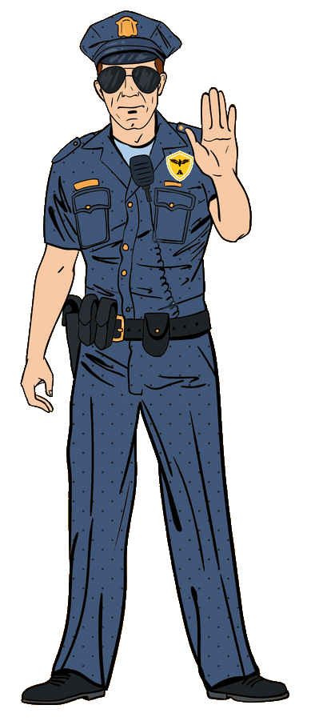

{ width="250" }

### **Core Agent Field Operations**

This role is supposed to be unique, depending on the ruleset; one Agent on the Field must spawn.

“Old fashioned ways still get the job done, Determined Deputy.”

Win Condition: Eliminate ALL hostile units (Netsec, W3C, and Neutral Killing). Opsec R requires the hack to not be complete in time.

### **Day:**

Unskilled Attack - Select a node, green or white. Leaves a log.

Place Bounty (N1 -> N3 cooldown) - Select a target operative. Tonight they will be attempted to be arrested.

Rallying Cry (N1 -> N4 cooldown, 2 charges) - All agents will be unable to be occupied.

### **Night:**

Arrest - Select a target operative and arrest them. Visit them.

Sting (1 charge) - Select a target operative and arrest them, along with anyone that visits them. Do not visit them.

Blowout Arrest (N1 -> N4 cooldown, 2 charges) - Select a target operative. Bypass all defensive skills, including Throw under the Bus and Misdirection. Can only be stopped if occupied. Visit, occupy, and arrest them.

Bouncer (N1 -> N3 cooldown, 2 charges) - Select a target operative. You will visit and occupy them like a Midnight Meet, and anyone who visits them will be occupied, like a Misdirection.

### **Passives:**

Agent on the Field - You are a Field Agent role.

Local Legend - You are known too well in the community. If you are murdered (not by vote), you can occupy someone in the Opsec of your choice in the next phase, as they will be hosting your funeral.