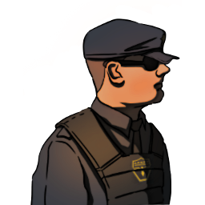

### **Core Agent Field Operations**

This role is supposed to be unique, depending on the ruleset; one Agent on the Field must spawn.

“You must perform the field operations and arrest them, Field Agent.”

Win Condition: Prevent the hack from completing on time.

### **Day:**

Unskilled Attack - Select a node, green or white. Leaves a log.

Alter Logs (D1 -> D3 cooldown) - Select a white or green node and either leave a singular fake connection log of one operative, or leave a few random connection logs.

ISP Isolation (3 charges) - Select a target operative and disable all day actions related to the topology done by them.

### **Night:**

Arrest - Select a target operative and arrest them. Visit them.

Sting (1 charge) - Select a target operative and arrest them, along with anyone that visits them. Do not visit them.

Planned Raid - Select a target operative and escort them. Choose whether tomorrow they will be arrested, or that you want to hold the arrests until you execute a raid, or until the operative moves hideout. Visit and occupy them. Must select a different target the next night.

Execute Raid - Arrest all raided operatives that are still in the same hideout. This skill cannot be occupied.

 

Agent Training (Pick one)

=======================================================================

Follow (2 charges) - Select a target operative and follow them, visiting them and checking if they left their hideout and met anyone. If they were occupied, you’d only know that they could not leave their hideout.

Throw Under the Bus (2 charges) - Select a target operative. All skills used on you will be used on the target operative.

Interrogate (3 charges) - Select a target operative and occupy them. The host will ask them for their logs, giving you what they send.

### **Passives:**

Agent on the Field - You are a Field Agent role.

Agent Training - Pick one of the three abilities between Follow, Throw Under the Bus, and Interrogate.