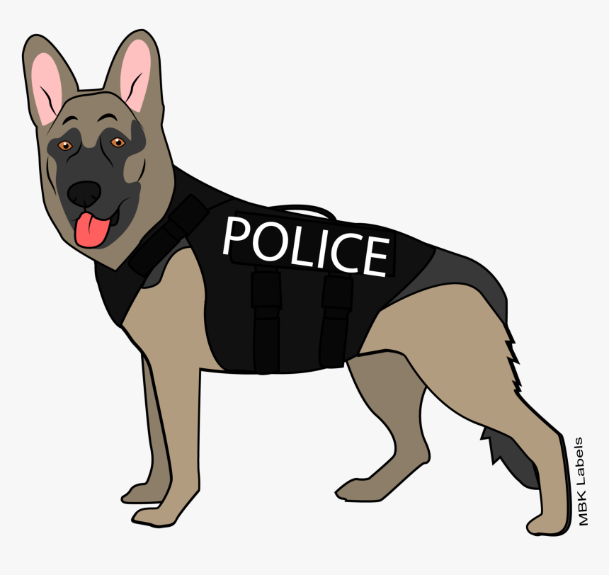

{ width="350" }

### **Core Agent Field Operations**

This role is supposed to be unique, depending on the ruleset.

“You are really good with training dogs, K-9 Unit.”

Win Condition: Eliminate ALL hostile units (Netsec, W3C, and Neutral Killing). Opsec R requires the hack to not be complete in time.

### **Day:**

Unskilled Attack - Select a node, green or white. Leaves a log.

Dog Treats (3 charges) - Your dog will be well fed at night, capable of being immune to occupation.

All in (1 charge) - Turn into a Field Agent. Can only be done if there are no Agent on the Field roles.

### **Night:**

Sniff-out (N1 -> N3 cooldown) - Select a target operative. If the operative is a drug dealer or has the potential to murder or disorganized murder in any way, let you know. Goes through cover or frames. Visit them.

Trained Assist (N1 -> N4 cooldown) - Select an agent operative. If they are arresting someone, make them immune to occupation. Visit them.

Trained Escort - Select an agent operative and escort them, protecting the operative from arrests and murders. Arrest attempts will be dodged, and anyone attempting to murder the protected operative will be killed. Visit your fellow agent, but do not occupy.

Guard Dog (N1 -> N3 cooldown) - Occupy anyone that visits you directly, blocking any attempts to visit, occupy, and kill directly. Does not save you from Raids, Stings, and other indirect methods of killing this operative.

### **Passives:**

Good Boy - You are protected by the first arrest or murder attempt.

Protective Boy - Guard Dog can be used along with any other ability at night.