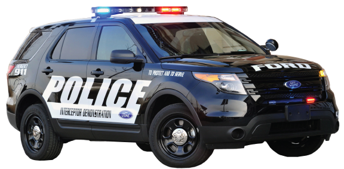

{ width="350" }

### **Core Agent Field Operations**

“Agents need a driver, and you are the fastest in the west, Police Car Driver.”

Win Condition: Eliminate ALL hostile units (Netsec, W3C, and Neutral Killing). Opsec R requires the hack to not be complete in time.

### **Day:**

Unskilled Attack - Select a node, green or white. Leaves a log.

Plan Patrol Route (1 charge) - Select two operatives, all operatives who visit either operative will be attempted to be arrested. Gain a charge of Add to Patrol Route and Patrol Route.

Add to Patrol Route (0 charges) - Select a target operative to add to the Patrol Route, making all operatives who visit this additional operative also be attempted to be arrested. Gain a charge of Add to Patrol Route.

Repair Vehicle (1 charge) - Regain the Hit the Nitrous passive.

### **Night:**

Arrest - Select a target operative and arrest them. Visit them.

Patrol Route (0 charges) - Attempt to arrest all operatives who visit any operative in the Patrol Route. Does not arrest the target operatives themselves. Gain a charge of Patrol Route.

Switch Gears (N1 -> N3 cooldown) - Select two operatives, all abilities that were used on the first player will be used on the second player, and vice versa. Visits the first operative.

Setup (2 charges) - Select two operatives. The first operative will visit and occupy the second operative, occupying both operatives. You may be the first target. Visits the first operative.

### **Passives:**

Agent on the Field - You are a Field Agent role.

Partner in crime-solving - If you are occupied while trying to use Patrol Route, anyone who visits operatives in the Patrol Route will continue to be arrested.

Hit the Nitrous - The first time you are arrested or murder attempted, hit the nitrous, dodging the arrest or murder.