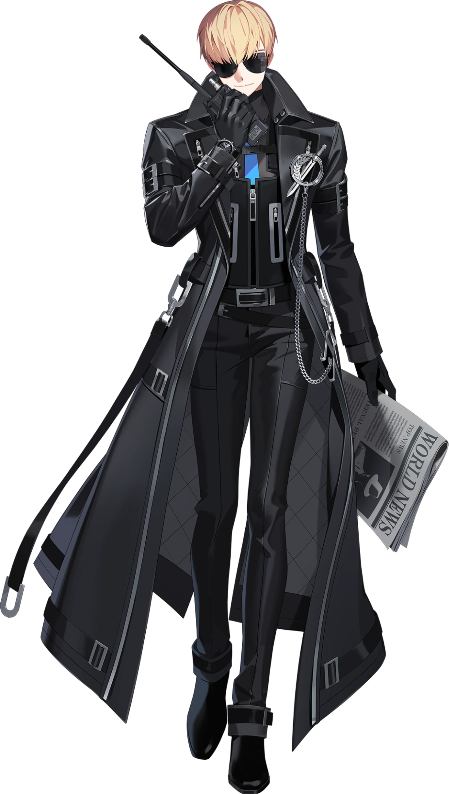

{ width="250" }

### **Core Agent Investigative**

This role is supposed to be unique, depending on the ruleset; one Agent on the Field must spawn.

“It’s time to take this case a step further, Cybercrime Investigator.”

Win Condition: Eliminate ALL hostile units, or at least 1 hostile unit per day/night phase.

### **Day:**

Hack Target (Moderate) - Select a white node and attempt to hack it. Leaves a log.

Download Intel - Select a green node and attempt to download from it. If there is intel, and you download and remove it first, you will get intel (see tips for list of intel). Do not go through frames or cover. Leaves a log.

Impersonate (1 charge) - Permanently rename your operative to whatever name you want. If you name it the same as another operative, targeting that operative will randomly target either operative of the same name.

Background Search (D1 -> D3 cooldown) - Check a target operative’s background. You’ll be given a (non-unique) random skill that they have, either day or night.

Plan B (1 charge) - If there is no Agent Leader, turn into an Agent Leader.

### **Night:**

Investigate Bottom - Arrest the operative below you in the list of operatives and give you the subclass of the operative below the operative. Goes through cover or frames. Visit them.

Investigate Hideout (N1 -> N3 cooldown) - Select a target operative. You will learn who they visited, and their subclass. Do not go through frames or cover. Visit them.

Deductive Reasoning (N1 -> N3 cooldown) - Select a target operative. You will learn their faction, and their subclass. Do not go through frames or cover. Visit them.

Throw Under the Bus (2 charges) - Select a target operative. All skills used on you will be used on the target operative.

Misdirection (1 charge) - Occupy anyone that visits you directly, blocking any attempts to visit, occupy, and kill directly. Does not save you from Raids, Stings, and other indirect methods of killing this operative.

### **Passives:**

Agent on the Field - You are a Field Agent role.

Calculated Disguise - If you do not take an action at night, your true faction is neutral.