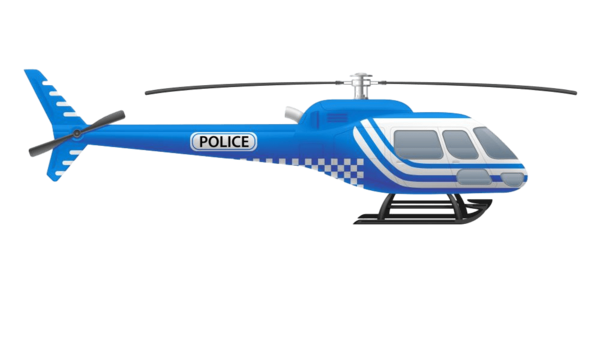

{ width="350" }

### **Core Agent Investigative**

This role is supposed to be unique, depending on the ruleset.

“No criminal will remain undetected from your flying machine, Helicopter Operator.”

Win Condition: Prevent the hack from completing on time.

### **Day:**

Unskilled Attack - Select a node, green or white. Leaves a log.

Scan Hideout (D1 -> D3 cooldown) - Select a target operative and learn the operative’s subclass. Goes through cover or frames.

Deep Learn (2 charges) - The next action will go through any kind of cover, frame, or passives.

To the Wheel (1 charge) - Turn into a Police Car Driver. Can only be done if there are no Agent on the Field roles.

### **Night:**

Perform Spotlight Surveillance (N1 -> N3 cooldown) - Selects a target operative and puts a spotlight on their hideout. See who visits the target operative tonight. Visit the target.

Investigate Hideout (N1 -> N3 cooldown) - Select a target operative. You will learn who they visited, and their subclass. Do not go through frames or cover. Visit them.

Aerial Reconnaissance (N1 -> N3 cooldown) - Select a target operative. Learn the exact ability they use tonight. Goes through cover or frames. If they did nothing, say they did nothing. Visit the operative.

Helicopter Lineman (N1 -> N4 cooldown, 2 charges) - Select a target operative. They will use your helicopter line tonight while they use their ability, shown as not leaving their hideout. The operative will know if they use the line. Visit the operative.

Misdirection (1 charge) - Occupy anyone that visits you directly, blocking any attempts to visit, occupy, and kill directly. Does not save you from Raids, Stings, and other indirect methods of killing this operative.

### **Passives:**

To the Skies - You are immune to occupation at night.