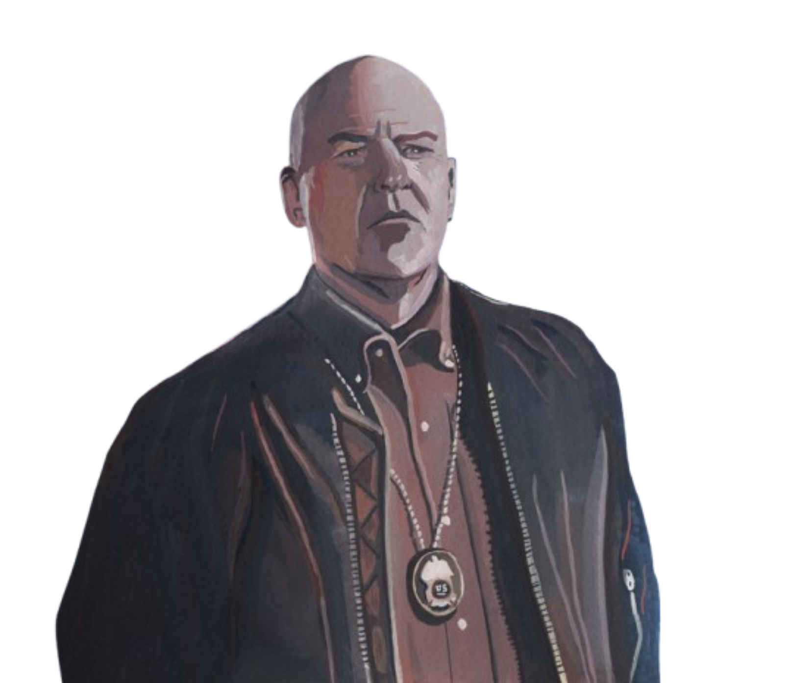

{ width="350" }

### **Core Agent Investigative**

This role is supposed to be unique, depending on the ruleset; one Agent on the Field must spawn.

“You know how to find any drug or contraband, Narcotics Officer.”

Win Condition: Eliminate ALL hostile units, or at least 1 hostile unit per day/night phase.

### **Day:**

Unskilled Attack - Select a node, green or white. Leaves a log.

Get Dirt - Select a target operative. You will get one of two class types that they can be. Do not go through frames or cover.

Connect the Dots (2 charges) - Select a target operative. Reveal, unframe, and unencrypt their logs. Tell you their role immediately.

Contraband Check (1 charge) - For the next night, any operatives arrested and murdered will have their roles revealed, unframed, and logs unencrypted, including through voting.

### **Night:**

Drug Bust - Select a target operative and arrest them. Reveals their true role, unframing them, and unencrypting their logs. Visit them.

Sting (1 charge) - Select a target operative and arrest them, along with anyone that visits them. Do not visit them.

Sniff-out (N1 -> N3 cooldown) - Select a target operative. If the operative is a drug dealer or has the potential to murder or disorganized murder in any way, let you know. Goes through cover or frames. Visit them.

Plant Drug (2 charges) - Select a target operative. Plant a drug on the operative and remove No Dirt on Me. Visit them.

Not a Narc (2 charges) - Select a target operative. Give them No Dirt on Me, making them immune to arrests. Visit them.

### **Passives:**

Agent on the Field - You are a Field Agent role.