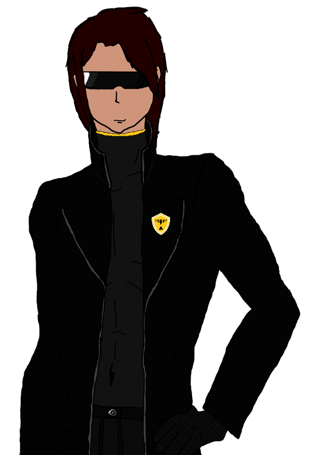

{ width="250" }

### **Core Agent Offensive**

This role is supposed to be unique, depending on the ruleset.

“Topology access granted, welcome back, Cipher Lord.”

Win Condition: Eliminate ALL hostile units (Netsec, W3C, and Neutral Killing). Opsec R requires the hack to not be complete in time.

### **Day:**

Unskilled Attack - Select a node, green or white. Leaves a log.

Hack Target (High) - Select a white node and attempt to hack it. Leaves a log.

Download Intel - Select a green node and attempt to download from it. If there is intel, and you download and remove it first, you will get class intel, target node, or faction intel. Do not go through frames or cover. Leaves a log.

All in (1 charge) - Turn into a Field Agent. Can only be done if there are no Agent on the Field roles.

 

Encryption Tactics (Pick 1)

=======================================================================

Firewall Layer (D1 -> D3 cooldown, 2 charges) - Select a layer, decreasing hacking chances of getting any node on this layer. Do not leave a log.

Encrypt Intel - Select a green node and attempt to erase intel from it. If there is intel, and you remove it first, you will get class intel, target node, or faction intel. Goes through cover or frames. Leaves a log.

Caesar Cipher (1 charge) - Select a layer, removing all intel on this layer. Do not leave a log.

### **Night:**

Midnight Meet (N1 -> N3 cooldown) - Select a target operative. Visit and occupy them, talking about the hack. Do not reveal yourself to them.

Encrypt Killswitch (2 charges) - Select a target operative. Upon death or arrest, the target’s role and logs will be encrypted and unable to be read. Gives you their role. Go through frames or cover. Visit them.

Wiretap (N1 -> N4 cooldown) - Select a target operative. Check the operative’s outgoing and ingoing communications to check for operatives that potentially are of the same owner. Gives three potential operatives that could be linked to the target operative. Visit them. Opsec R checks if they were offered a deal this day or night.

### **Passives:**

Deep Fake Disguise - You can pick any class to frame yourself as until Day 4. Cannot be arrested unless you are framed.

Encryption Tactics - Pick one ability from Firewall Layer, Encrypt Intel, and Caesar Cipher.