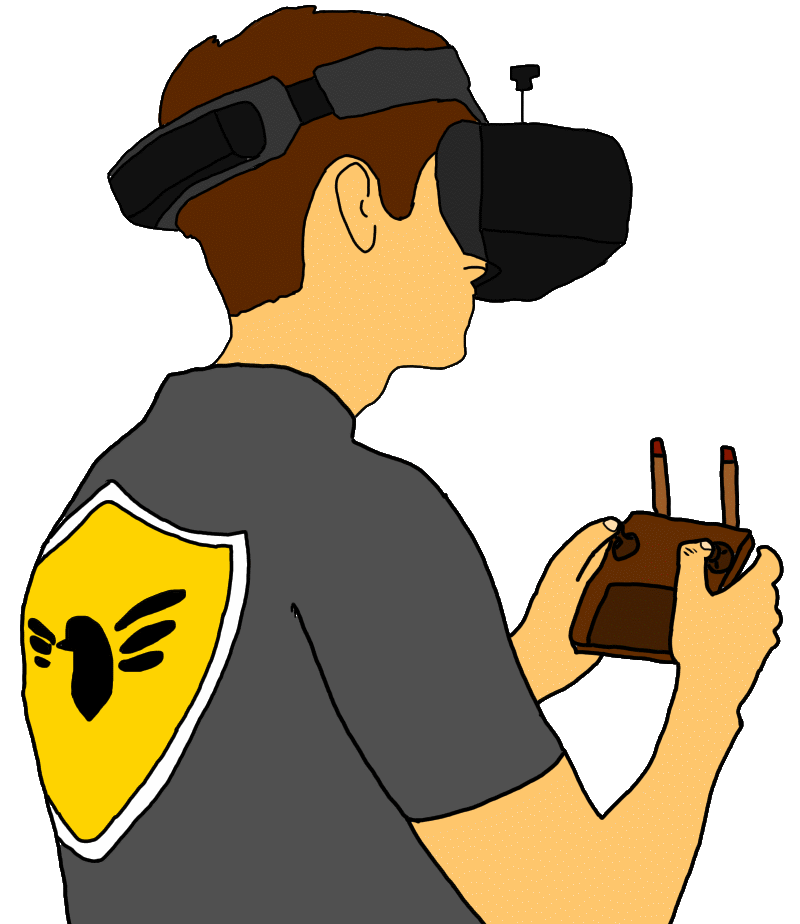

{ width="350" }

### **Core Agent Field Operations**

This role is supposed to be unique, depending on the ruleset; one Agent on the Field must spawn.

“Let’s show Netsec what cutting edge is like, Drone Operator.”

Win Condition: Eliminate ALL hostile units, or at least 1 hostile unit per day/night phase.

### **Day:**

Hack Target (Moderate) - Select a white node and attempt to hack it. Leaves a log.

Internet of Things Breach - Select a target operative and increase their hack chance this phase.

Sabotage Internet of Things - Select a target operative and lower their hack chance this phase.

Charge Batteries - Remove the cooldown on Drone Reconnaissance or Drone Mark for the next night.

Fabricate Evidence (0 charges) - Have an agent lawyer fabricate evidence after killing to set another operative to be arrested at night. This protects you tonight.

### **Night:**

Drone Reconnaissance (N1 -> N3 cooldown) - Select a target operative. Learn the exact ability they use tonight. Goes through cover or frames. If they did nothing, say they did nothing. Visit the operative.

Drone Mark (N1 -> N3 cooldown) - Select a target operative and leave a follow notification. Tomorrow they will be arrested by local cops. Visit them.

Drone Bomb (1 charge) - Select two target operatives. Send your two drones out and bomb their hideouts, killing both of them. Do not visit them.

### **Passives:**

Agent on the Field - You are a Field Agent role.

Do the Crime, Do the Time - If you kill someone, you get arrested the next night. Gain 1 charge of Fabricate Evidence on killing someone. Can be dodged by escorting or protecting the operative.