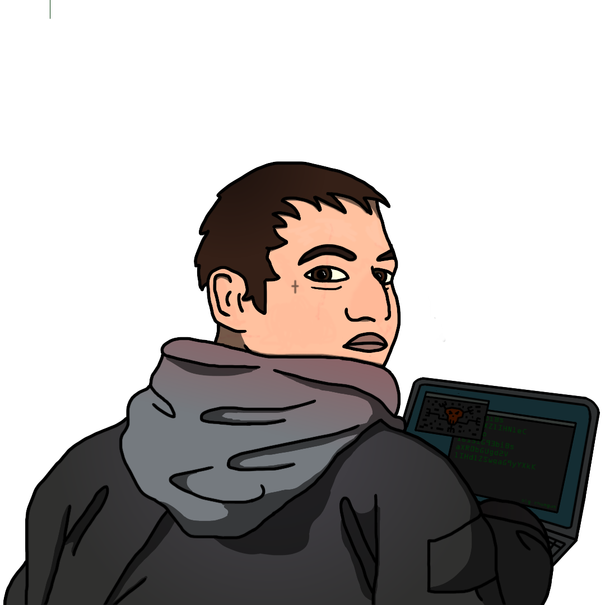

{ width="350" }

### **Core Agent Special**

This role is unique, at most one Operation Leader should spawn; one Agent on the Field must spawn.

“Agents caught up to you before the Opsec even started, Blackmailed Leader.”

Win Condition: Prevent the hack from completing on time.

### **Day:**

Hack Target (High) - Select a white node and attempt to hack it. Leaves a log.

Harden Node (D1 -> D3 cooldown, 2 charges) - Select a white node. Decreasing hacking chances of getting this node. Strongest hacking chance nerf. Leaves a log.

Give Root Access (1 charge) - Select an operative to give root to. They become any of Operation Leader, Blackmailed Leader, Sociopath Leader, W3C Operation Leader, Paragon Operation Leader, or are simply an agent, neutral, Paragon Leader, or W3C Leader with access to the special channel. A Neutral Leader can only spawn in.

### **Night:**

Move Hideout (1 charge) - Move your hideout, protecting yourself unless you are occupied.

Fake Emergency Extraction (N1 -> N3 cooldown, 3 charges) - Select an operative to fake escort, does not occupy them and doesn’t actually do anything except leaving escort text. Do not visit them.

Assault and Battery - Select an operative and attempt to murder them. Visit the target.

### **Passives:**

Agent on the Field - You are a Field Agent role.

Authority - You have two votes.

Covert Broadcast - You should be given access to talk to all players in a specialized channel (global Opsec info).

Operation Leader - You are one of the leading roles and may spawn every operation.