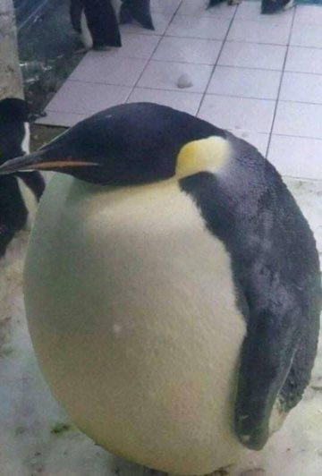

{ width="250" }

### **Core Agent Utility**

This role is supposed to be unique, depending on the ruleset.

“Animals love you, now spread the love to Netsec, Animal Tamer.”

Win Condition: Eliminate ALL hostile units, or at least 1 hostile unit per day/night phase.

### **Day:**

Unskilled Attack - Select a node, green or white. Leaves a log.

Monkey Hack - Have your pet monkey hack randomly. Your monkey will randomly hack a white node with scripts from the internet. (Random hack chance)

Elephant Training (D1 -> D3 cooldown, 3 charges) - Loudly blow your elephant's nose, distracting both operatives above and below you that are not agents, preventing them from doing actions today.

Rat Jam (3 charges) - Select a target operative. Send rats to their house, annoying them and lowering their hack chance by one stage temporarily.

All in (1 charge) - Turn into a Field Agent. Can only be done if there are no Agent on the Field roles.

### **Night:**

Dolphin Attack (2 charges) - Select a target operative, and attack them with dolphins. They will have to heal from their wounds tomorrow, preventing them from using actions tomorrow night. Visit them.

Ace Rhino (N1 -> N3 cooldown) - Select a target operative, ramming their hideout and occupying them. Destroy their hardware, preventing them from doing day actions for the next day. Visit and occupy them.

Penguin's Sock (N1 -> N3 cooldown) - Select an agent operative. Make them immune to occupation. Visit them. (Triggers Animal Lover).

Bombardino Crocodilo (2 charges) - Select an agent operative and escort them, protecting the operative from arrests and murders. Anyone attempting to murder or arrest the protected operative will be killed. Visit your fellow agent, but do not occupy. (Triggers Animal Lover).

Beary Good - Send your bear to destroy all dumpsters in the Opsec, making the dumpster dive not work for two days.

### **Passives:**

Animal Lover - Operatives love you, they will stop to pet your animals even at the expense of the hack. Visiting your fellow agent operatives that are supported by an ability at night will occupy the operatives that visit the supported agent operative.