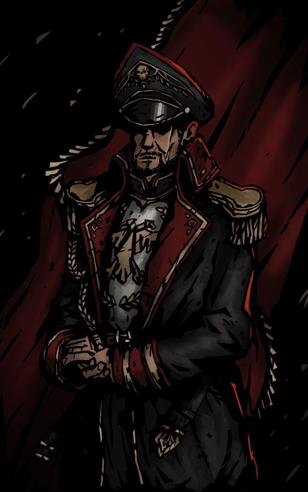

{ width="250" }

### **Core Agent Utility**

This role is supposed to be unique, depending on the ruleset.

“You trained agents up to where they are, Commissary Officer.”

Win Condition: Eliminate ALL hostile units, or at least 1 hostile unit per day/night phase.

### **Day:**

Unskilled Attack - Select a node, green or white. Leaves a log.

Plant Fake Info - Decreases hacking chances on a random node.

Commissar’s Orders (2 charges) - You can write one message to talk to all players in a specialized channel (global Opsec info). This message can appear when you want it tonight.

Rallying Cry (N1 -> N4 cooldown, 2 charges) - All agents will be unable to be occupied.

Back in the Force (1 charge) - Turn into a Determined Deputy. Can only be done if there are no Agent on the Field roles.

### **Night:**

Motivation (N1 -> N3 cooldown) - Select an agent operative. For tonight, they are immune to occupation. Visit them.

Blowout (N1 -> N4 cooldown, 2 charges) - Select a target operative. Bypass all defensive skills, including Throw under the Bus and Misdirection. Can only be stopped if occupied. Visit and occupy them.

Shakedown (2 charges) - Select a target operative and learn the target’s subclass and if they attempted to visit other operatives. Do not go through frames or cover. Visit and occupy them.

### **Passives:**

Cover Checks Out - You can pick a Netsec class to frame yourself as until Day 2. Cannot be arrested unless you are framed.