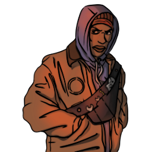

### **Mole Agent Field Operations**

“In order to escape prison, you took a plea deal as a CCTV Specialist. Agents could use your camera work, Agent CCTV Specialist.”

Win Condition: Eliminate ALL hostile units (Netsec, W3C, and Neutral Killing). Opsec R requires the hack to not be complete in time.

### **Day:**

Unskilled Attack - Select a node, green or white. Leaves a log.

Jam Network (2 charges) - Select a target operative and disable all day actions related to the topology done by them.

### **Night:**

Install CCTV Surveillance (D1 -> D3 cooldown, 2 charges) - Selects a target operative and places a camera on their hideout. The camera is destroyed upon moving hideout or getting escorted. Visit the target.

Interrogate (3 charges) - Select a target operative and occupy them. The host will ask them for their logs, giving you what they send.

### **Passives:**

Perform CCTV Surveillance - Passively see who visits the target operatives that the cameras are attached to.