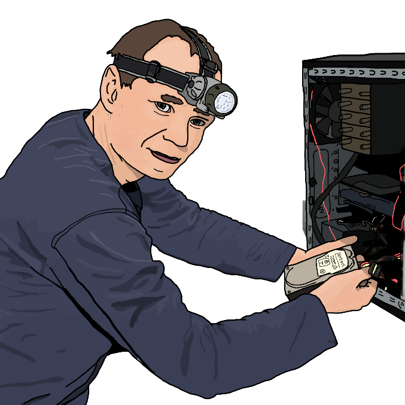

{ width="250" }

### **Mole Agent Field Operations**

“In order to escape prison, you took a plea deal as a Hardware Expert. Agents could use your Internet of Things knowledge, Agent Hardware Hacker.”

Win Condition: Eliminate ALL hostile units, or at least 1 hostile unit per day/night phase.

### **Day:**

Unskilled Attack - Select a node, green or white. Leaves a log.

Review TCP Packets (N1 -> N4 cooldown, 2 charges) - Select a target operative and check if they used a hack today.

Sabotage Internet of Things - Select a target operative and lower their hack chance this phase.

### **Night:**

Smash Hardware (N1 -> N3 cooldown) - Select an operative and disable all day actions related to the topology. Occupies and visits them. (Same as Midnight Meet).

Follow (2 charges) - Select a target operative and follow them, visiting them and checking if they left their hideout and met anyone. If they were occupied, you’d only know that they could not leave their hideout.

### **Passives:**

None.