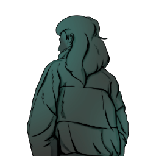

### **Mole Agent Field Operations**

This role is ONLY through a Criminal Psychologist, not a role that exists without the Criminal Psychologist.

“A famous Criminal Psychologist convinced you to help them, Specialist.”

Win Condition: Eliminate ALL hostile units (Netsec, W3C, and Neutral Killing). Opsec R requires the hack to not be complete in time.

### **Day:**

Unskilled Attack - Select a node, green or white. Leaves a log.

Denial of Service (2 charges) - Select a green or white node and block all connections to the node this day. Do not leave a log.

### **Night:**

Bodyblock (3 charges) - Select a target operative. Occupy anyone that visits the target, but does not occupy the target operative themselves. Visit them.

Scapegoat - Select two target operatives, all skills used on the first operative this night will be used on the second operative, works similar to Throw Under the Bus.

Setup (2 charges) - Select two operatives. The first operative will visit and occupy the second operative, occupying both operatives. You may be the first target. Visits the first operative.

Attempt Murder - Select an operative and attempt to murder them. Visit the target.

### **Passives:**

Aggressor - You may attempt to use attempt murder and another skill on the same night.

Counterkill - If any murdering or arresting skill was used on an agent, you will attempt to kill the murderer or arrester.