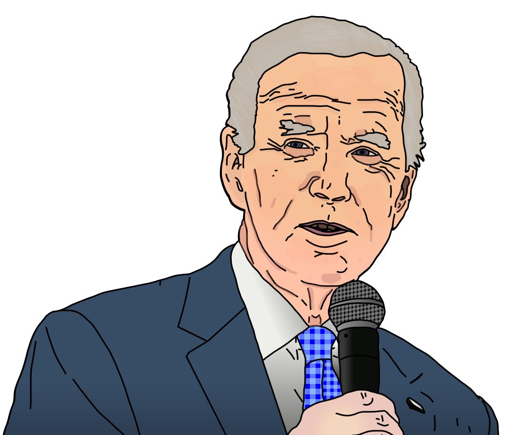

{ width="350" }

### **Mole Agent Utility**

“In order to escape prison, you took a plea deal as a Propagandist. Agents could use your powerful fighting spirit, Agent Propagandist.”

Win Condition: Eliminate ALL hostile units, or at least 1 hostile unit per day/night phase.

### **Day:**

Unskilled Attack - Select a node, green or white. Leaves a log.

Broadcast Message (1 charge) - You can write one message to talk to all players in a specialized channel (global Opsec info). This message can appear when you want it tonight.

### **Night:**

Mock Interview (N1 -> N3 cooldown) - Check whether an operative has their hack chance increased or decreased in the last day and this night, letting you know specifically if it was increased or decreased. Visit them.

Uplift Agent - Select a Agent operative. For tonight, they are immune to occupation. Visit them.

Cover Support (3 charges) - Select a target operative and pick a subclass. For tonight and the following day, they will have cover as Netsec and appear as that subclass to any subclass checking skills. Visit them.

### **Passives:**

None.