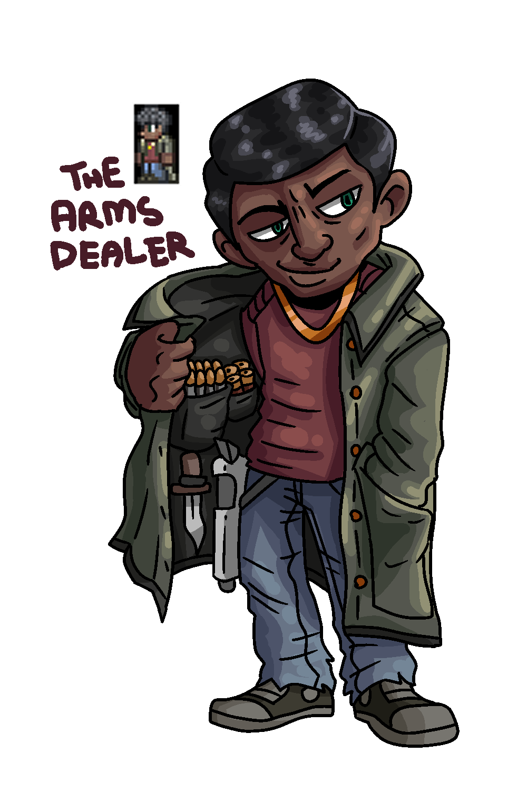

{ width="250" }

### **Netsec Field Operations**

“Netsec is paying you a hefty sum for your guns and assets, Arms Dealer.”

Win Condition: Eliminate ALL hostile units.

### **Day:**

Unskilled Attack - Select a node, green or white. Leaves a log.

Desperate Measures (1 charge) - Turn into an Improvised Hacker.

### **Night:**

Emergency Extraction (N1 -> N3 cooldown, 3 charges) - Select an operative to escort, does not occupy them and makes them immune to everything unless otherwise stated. Do not visit them.

Sell Illicit Arms (N1 -> N3 cooldown) - Select a target operative. If they do not have access to the skill Disorganized Murder, give them 1 charge of Disorganized Murder the following night. This charge of Disorganized Murder is removed if it is not used the night it is given. Visit them.

### **Passives:**

None.