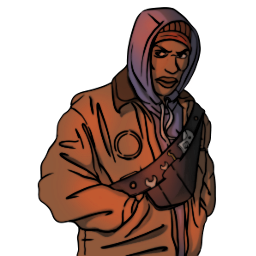

### **Netsec Field Operations**

“Your watchful eye is Netsec’s hidden guardian, CCTV Specialist.”

Win Condition: Eliminate ALL hostile units (Agents, W3C, and Neutral Killing), or hack the target node.

### **Day:**

Unskilled Attack - Select a node, green or white. Leaves a log.

Create Hideout (D1 -> D4 cooldown, 2 charges) - Grants you one charge of Move Hideout.

Bait Law Enforcement - Select a target operative, inform agents that the target is one working for Netsec. Can be yourself. (Leaves the same message as Bounty Hunter’s Spill the Beans).

Desperate Measures (1 charge) - Turn into an Improvised Hacker. Breaks previous cameras.

### **Night:**

Install CCTV Surveillance (D1 -> D3 cooldown, 2 charges) - Selects a target operative and places a camera on their hideout. The camera is destroyed upon moving hideout or getting escorted. Visit the target.

Move Hideout (1 charge) - Move your hideout, protecting yourself unless you are occupied.

### **Passives:**

Perform CCTV Surveillance - Passively see who visits the target operatives that only your cameras are attached to.