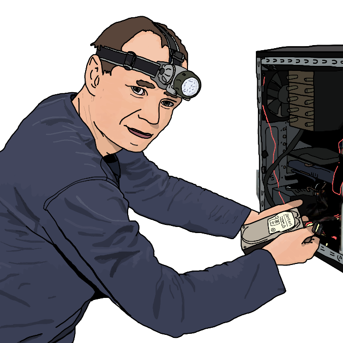

{ width="350" }

### **Netsec Field Operations**

“You are hired for your massive knowledge on embedded systems and Internet of Things, Hardware Hacker.”

Win Condition: Eliminate ALL hostile units (Agents, W3C, and Neutral Killing), or hack the target node.

### **Day:**

Hack Target (Low) - Select a white node and attempt to hack it. Leaves a log.

Bait Law Enforcement (D1 -> D3 cooldown) - Select a target operative, inform agents that the target is one working for Netsec. (Leaves the same message as Bounty Hunter’s Spill the Beans).

Internet of Things Breach - Select a white node, increasing hacking chances of getting this node. This does not leave a log.

### **Night:**

Smash Hardware (N1 -> N3 cooldown) - Select an operative and disable all day actions related to the topology. Occupies and visits them. (Same as Midnight Meet).

Tamper Wiring (2 charges) - Select an operative and disable all night actions related to the topology. Visit them.

### **Passives:**

None.