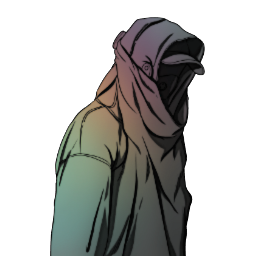

### **Netsec Field Operations**

This role is ONLY through desperate measures, not a starting role. Do NOT claim this role.

“Desperate times call for desperate measures, Improvised Hacker.”

Win Condition: Eliminate ALL hostile units.

### **Day:**

Hack Target (Very Low) - Select a white node and attempt to hack it. Leaves logs.

Download Intel - Select a green node and attempt to download from it. If there is intel, and you download and remove it first, you will get intel (see tips for list of intel). Leaves a log.

### **Night:**

Study (N1 -> N3 cooldown) - Increases your hacking stage by one the following day.

Move Hideout (1 charge) - Move your hideout, protecting yourself unless you are occupied.

Dumpster Dive - Increases hacking chances on a random node.

### **Passives:**

Same Old Me - Keep your original subclass from the role you turned from.