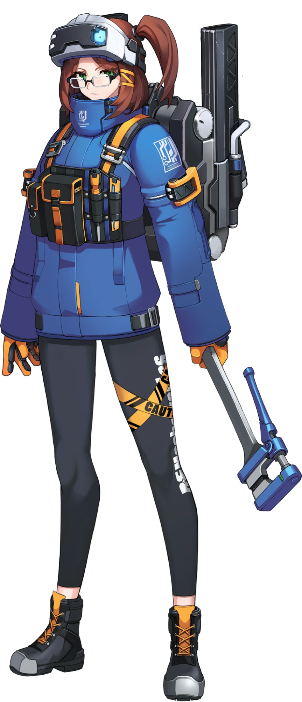

{ width="150" }

### **Netsec Investigative**

“Your combined knowledge on embedded systems and ability to decipher fellow operative’s skill set allows you to help this Opsec, Computer Technician.”

Win Condition: Eliminate ALL hostile units (Agents, W3C, and Neutral Killing). Opsec R needs to hack the target node.

### **Day:**

Hack Target (Low) - Select a white node and attempt to hack it. Leaves a log.

Download Intel - Select a green node and attempt to download from it. If there is intel, and you download and remove it first, you will get class intel, target node, or faction intel. Do not go through frames or cover. Leaves a log.

Upload Intel (0 charges) - Select a green node and upload intel that is downloadable by others. Whoever downloading will get class intel, target node, or faction intel. Leaves a log.

### **Night:**

Steal Intel (1 charge) - Steal intel and gain one charge of upload intel.

Review Specialization (N1 -> N4 cooldown, 2 charges) - Select a target operative. Learn their subclass, or framed or cover subclass. Do not go through frames or cover. Visit them.

Review Connection Logs (2 charges) - Selects a target operative. Check if their connection was altered through ISP Isolation or Jam Network the previous day, and make them immune to ISP Isolation or Jam Network the following day. Visit them.

### **Passives:**

None.