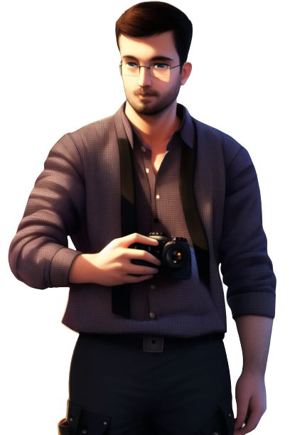

{ width="250" }

### **Netsec Investigative**

“You know how to analyze pictures using machine learning models and computer vision, Computer Vision Engineer.”

Win Condition: Eliminate ALL hostile units (Agents, W3C, and Neutral Killing), or hack the target node.

### **Day:**

Hack Target (Low) - Select a white node and attempt to hack it. Leaves a log.

Image Recognition (0 charges) - Predict what the first operative that you gathered data did last night, gives three actions which could be what he did last night. Doing nothing may be an action. Goes through frames and cover.

Image Classification (0 charges) - Predict what the first operative that you gathered data did today, gives three actions which could be what he did yesterday. Doing nothing may be an action. Goes through frames and cover.

### **Night:**

Data Gathering - Select a target operative and take a picture of their hideout. Grants one charge of Image Recognition or Image Classification targeting this operative- your choice. Visit them.

Mock Interview (N1 -> N3 cooldown) - Check whether an operative has their hack chance increased or decreased in the last day and this night, letting you know specifically if it was increased or decreased. Visit them.

### **Passives:**

None.