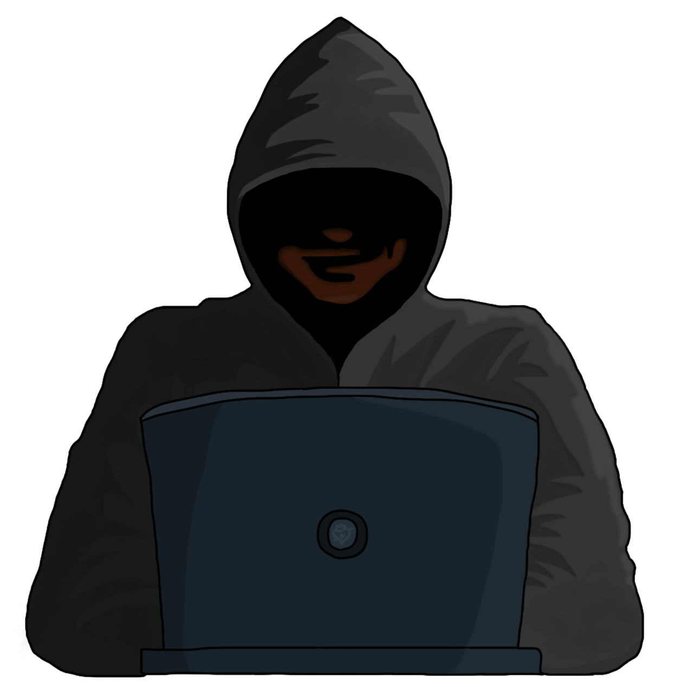

{ width="350" }

### **Netsec Investigative**

“The dark web calls and you are an absolute sadist for dark web content, Dark Web Contact.”

Win Condition: Eliminate ALL hostile units (Agents, W3C, and Neutral Killing), or hack the target node.

### **Day:**

Hack Target (Moderate) - Select a white node and attempt to hack it. Leaves a log.

Wireshark (D1 -> D4 cooldown) - Tells you the name of any operative that did a Denial of Service.

Dark Web Connections (2 charges) - Select a white node. If the node isn’t hacked, the node’s connection logs are revealed to you anyway.

### **Night:**

Doxx and Stalk (N1 -> N4 cooldown, 2 charges) - Select a target operative. Do not go through frames or cover. Learn this operative’s faction alignment and visit them.

Cover Your Tracks (2 charges) - Move your hideout, protecting yourself unless you are occupied. Arrest attempts will show a result similar to a target that is immune to arrest, like No Dirt On Me.

### **Passives:**

None.