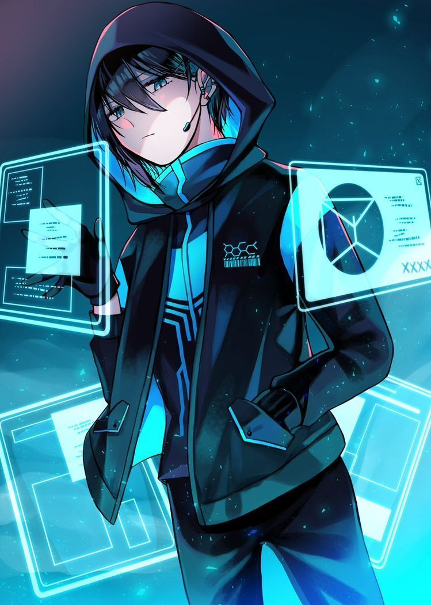

{ width="250" }

### **Netsec Investigative**

“You know how to get extra clicks or break any website, Search Engine Optimizer.”

Win Condition: Eliminate ALL hostile units.

### **Day:**

Hack Target (Low) - Select a white node and attempt to hack it. Leaves a log.

Download Intel - Select a green node and attempt to download from it. If there is intel, and you download and remove it first, you will get intel (see tips for list of intel). Do not go through frames or cover. Leaves a log.

Information Retrieval - Search the web and scrape the web for intel. Finds if there is intel on currently hacked nodes. Do not leave a log.

Background Search (D1 -> D3 cooldown) - Check a target operative’s background. You’ll be given a (non-unique) random skill that they have, either day or night. Do not go through frames or cover.

Overload Website (2 charges) - Select a green node, increasing hacking chances of getting this node permanently. Strongest hacking chance buff. Do not leave a log.

### **Night:**

Cover Your Tracks (2 charges) - Move your hideout, protecting yourself unless you are occupied. Arrest attempts will show a result similar to a target that is immune to arrest, like No Dirt On Me.

### **Passives:**

Linear Runtime - You are extremely optimized, you know how to optimize your code. If you hack, download intel, or retrieve info, you can do another action.