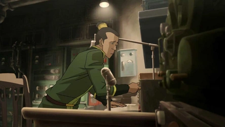

{ width="450" }

### **Netsec Social**

“You know your way around radios and other communications devices like no other, Radio Operator.”

Win Condition: Eliminate ALL hostile units.

### **Day:**

Unskilled Attack - Select a node, green or white. Leaves a log.

Jam Network (2 charges) - Select a target operative and disable all day actions related to the topology done by them.

Hack Private Channel (2 charges) - You can write one message to talk to all players in ASC or W3C channels, speaking directly to only Agent and/or W3C players, which appears next night.

Desperate Measures (1 charge) - Turn into an Improvised Hacker.

### **Night:**

Wiretap (N1 -> N3 cooldown) - Select a target operative. Check the operative’s outgoing and ingoing communications to check the operative's vote power and whether they are force voted and to who. Visit them.

Move Hideout (1 charge) - Move your hideout, protecting yourself unless you are occupied.

### **Passives:**

Blackmailed Informant - Any time an Agent uses Deductive Reasoning or Informant, you will get information that agents get. Do not go through frames or cover.

From the Grape Vine - You know if Agents have a mole role or not in play.