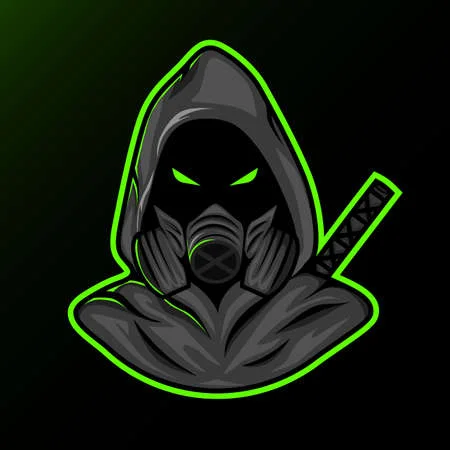

{ width="350" }

### **Netsec Social**

“You are supposed to be on the Operation Leader’s payroll, but you needed to train up as one of the operatives first, Rookie Assassin.”

Win Condition: Eliminate ALL hostile units (Agents, W3C, and Neutral Killing). Opsec R needs to hack the target node.

### **Day:**

Hack Target (Low) - Select a white node and attempt to hack it. Leaves a log.

Proving Shot - Select a target operative and guess their role. If you guess right, attempt to shoot the target operative tonight. If you guess wrong, take your own life instead. Removes all frames and covers. You will know if you guessed right or wrong.

### **Night:**

Proving Shot - Select a target operative and guess their role. If you guess right, attempt to shoot the target operative. If you guess wrong, take your own life instead. Removes all frames and covers.

Follow (2 charges) - Select a target operative and follow them, visiting them and checking if they left their hideout and met anyone. If they were occupied, you’d only know that they could not leave their hideout.

Misdirection (1 charge) - Occupy anyone that visits you directly, blocking any attempts to visit, occupy, and kill directly. Does not save you from Raids, Stings, and other indirect methods of killing this operative.

### **Passives:**

Assassin’s Creed - If you are voted, the veteran assassin will kill you and feel guilty the next phase, making there be no voting on the next phase.