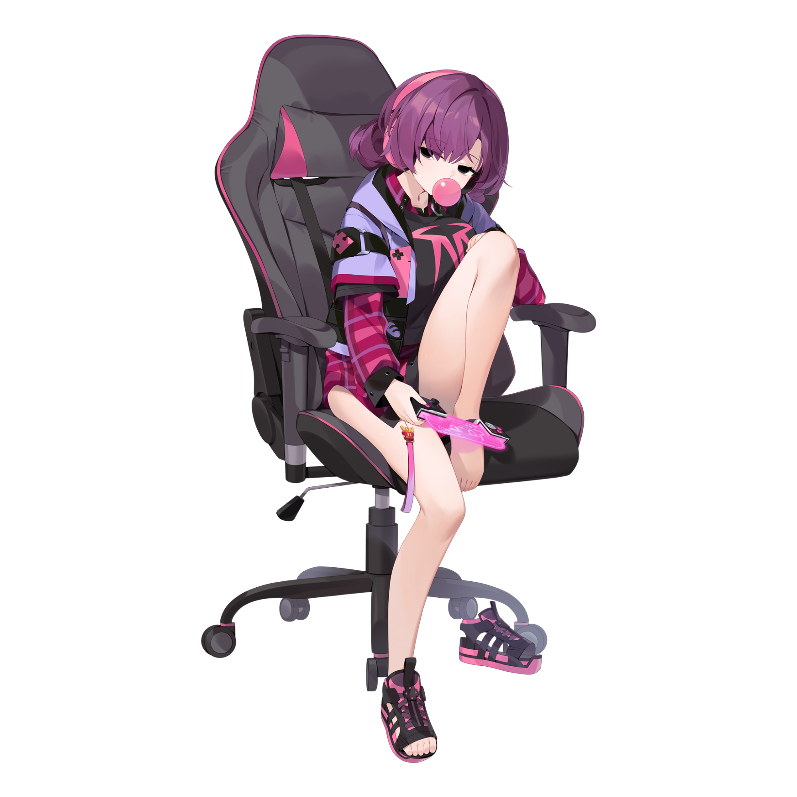

{ width="350" }

### **Netsec Social**

“Netsec needs your advertising and social media skills, Social Media Manager.”

Win Condition: Eliminate ALL hostile units.

### **Day:**

Unskilled Attack - Select a node, green or white. Leaves a log.

Shitpost on Social Media - Shitpost on social media, increasing hacking chances on a random node, because someone leaked information. Similar to Dumpster Dive.

Post Photoshoot (0 charges) - Post your Photoshoot, convincing agents to give you insider information. Tells you the IP of a node with downloadable intel on it. Give back 1 charge of Photoshoot.

Post Videotape Advertising (0 charges) - Make all white nodes easier to hack today. Weak hacking buff. Give back 1 charge of Videotape Advertising.

Desperate Measures (1 charge) - Turn into an Improvised Hacker.

### **Night:**

Photoshoot (1 charge) - Shoot a photoshoot of yourself, granting 1 charge of Post Photoshoot.

Videotape Advertising (1 charge) - Videotape an advertisement for Netsec, granting 1 charge of Post Videotape Advertising.

Arrest Recording (N1 -> N4 cooldown, 2 charges) - Select a target operative. If they are arrested tonight, you will record the footage, displaying it to the public (not global). Whoever arrested the operative will be notified and occupied the next night. Visit them.

### **Passives:**

Social Media Handler - You can change your operative name every other day starting on day 2.