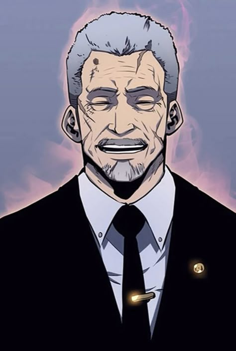

{ width="250" }

### **Netsec Special**

This role is unique, at most one Operation Leader should spawn.

“You were paid in huge shares on the stock market for this operation to go well, Majority Shareholder.”

Win Condition: Eliminate ALL hostile units (Agents, W3C, and Neutral Killing), or hack the target node.

### **Day:**

Unskilled Attack - Select a node, green or white. Leaves a log.

Majority Owner - Force someone to vote for someone of your choice.

Give Root Access (1 charge) - Select an operative to give root to. Upon your death, they can choose to become an Operation Leader of their own faction or stay as their current role with broadcast.

Shark Tank (2 charges) - Host a shark tank with many businessmen, gaining shares off of great deals investing in great companies, granting you +2 votes the next phase.

On My Payroll (1 charge) - If you want to use the assassin to kill someone, use a charge to kill that operative instead of the operative getting voted. The other operative must have at least 1 vote.

Override Assassin (1 charge) - If you think that the operative getting voted is not someone that should die, don’t have the assassin kill them. The vote will be skipped.

### **Night:**

Majority Owner - Force someone to vote for someone of your choice.

Move Hideout (1 charge) - Move your hideout, protecting yourself unless you are occupied.

Shark Tank (2 charges) - Host a shark tank with many businessmen, gaining shares off of great deals investing in great companies, granting you +2 votes the next phase.

On My Payroll (1 charge) - If you want to use the assassin to kill someone, use a charge to kill that operative instead of the operative getting voted. The other operative must have at least 1 vote.

Override Assassin (1 charge) - If you think that the operative getting voted is not someone that should die, don’t have the assassin kill them. The vote will be skipped.

### **Passives:**

Authority - You have two votes.

Covert Broadcast - You should be given access to talk to all players in a specialized channel (global Opsec info).

Operation Leader - You are one of the leading roles and may spawn every operation.

Shared Vested Stock - The charges of Shark Tank, Override Assassin, and On My Payroll are only usable once in day or night.