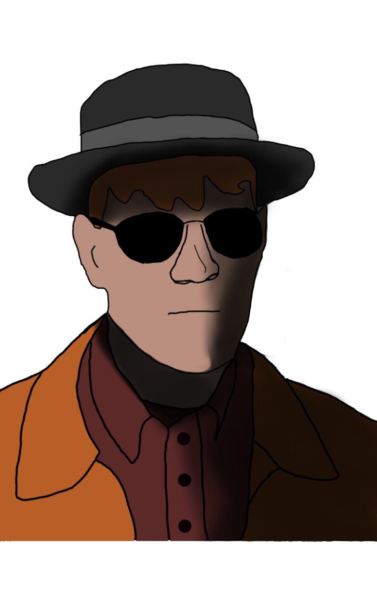

{ width="200" }

### **Netsec Utility**

“Desperate times call for desperate adderall abuse, Drug Dealer.”

Win Condition: Eliminate ALL hostile units (Agents, W3C, and Neutral Killing), or hack the target node.

### **Day:**

Unskilled Attack - Select a node, green or white. Leaves a log.

Prepare Drugs - Gives a charge of a drug of choice to use at night.

Desperate Measures (1 charge) - Turn into an Improvised Hacker.

### **Night:**

Sell Meth (0 charges) - Select a target operative. Sell them Methamphetamine and make them immune to occupation for this turn. Visit them.

Sell Adderall (0 charges) - Select a target operative. Sell them Adderall, and give them one extra action in the day. Visit them.

Sell Cocaine (0 charges) - Select a target operative. Sell them Cocaine, and make them dodge arrests or murder attempts for this turn (that are not guaranteed murders). Visit them.

### **Passives:**

Overdose - If you give someone drugs three times in a row, they overdose and immediately die.