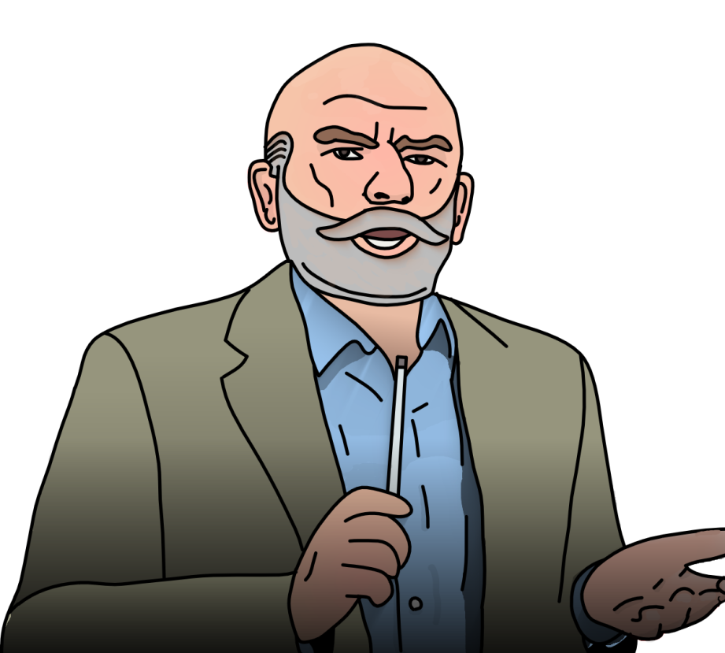

{ width="350" }

### **Netsec Utility**

“It’s time to see how your students have grown, Hacking Instructor.”

Win Condition: Eliminate ALL hostile units (Agents, W3C, and Neutral Killing). Opsec R needs to hack the target node.

### **Day:**

Unskilled Attack - Select a node, green or white. Leaves a log. (You know how to hack, but you don’t want to do it unless absolutely necessary.)

Desperate 0-day (1 charge) - Select a white node and instantly hack it. Leaves a log.

Desperate Measures (1 charge) - Turn into an Improvised Hacker. Automatically start with Very High hacking chances.

### **Night:**

For the Cause (N1 -> N4 cooldown, 2 charges) - Find out if the target operative is a mole. Do not go through frames or cover. Visit them. Opsec R checks if they changed their win condition tonight.

Pair Programming (1 charge) - Select a target operative, their hacking chance permanently increases by one stage. Visit them.

Advisor (N1 -> N3 cooldown) - Select a target operative, their hacking chance temporarily increases by one stage. Visit them.

### **Passives:**

Old Guard - If asked the right question, they will receive a Very High hacking chance result.