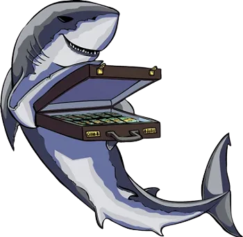

{ width="350" }

### **Netsec Utility**

“You are pretty crafty at getting money out of people, Loan Shark.”

Win Condition: Eliminate ALL hostile units (Agents, W3C, and Neutral Killing), or hack the target node.

### **Day:**

Unskilled Attack - Select a node, green or white. Leaves a log.

Buy Field Operations (0 charges) - Buy one night ability with one charge between Misdirection, Emergency Extraction, and Follow.

 

(Only after Hacking Tools are bought, only one is picked per bought tool, only one charge).

=======================================================================

Hack Target (Moderate, 1 charge) - Select a white node and attempt to hack it. Leaves a log.

Download Intel (1 charge) - Select a green node and attempt to download from it. If there is intel, and you download and remove it first, you will get class intel, target node, or faction intel. Do not go through frames or cover. Leaves a log.

Probe Node (1 charge) - Select a white node, increasing hacking chances of getting this node. Strongest hacking chance buff. Leaves a log.

### **Night:**

Sell Loan (N1 -> N3 cooldown) - Select a target operative. Visit and occupy them, gaining a charge of Buy Hacking Tools or Buy Field Operations. (Same as Midnight Meet).

Buy Hacking Tools (0 charges) - Buy one day ability with one charge between Hack Target (Moderate), Download Intel, and Probe Node.

 

(Only after Field Operations are bought, only one is picked per bought tool, only one charge).

=======================================================================

Misdirection (1 charge) - Occupy anyone that visits you directly, blocking any attempts to visit, occupy, and kill directly. Does not save you from Raids, Stings, and other indirect methods of killing this operative.

Emergency Extraction (N1 -> N3 cooldown, 1 charge) - Select an operative to escort, does not occupy them and makes them immune to everything unless otherwise stated.

Follow (1 charge) - Select a target operative and follow them, visiting them and checking if they left their hideout and met anyone. If they were occupied, you’d only know that they could not leave their hideout.

### **Passives:**

None.