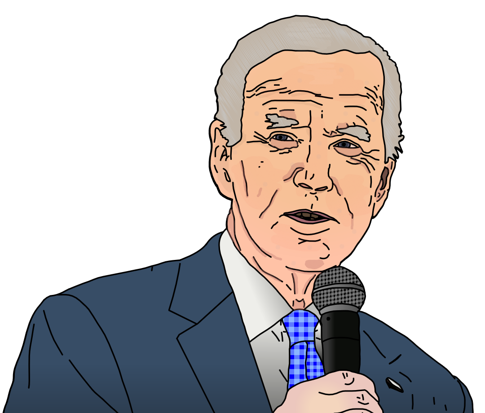

{ width="350" }

### **Netsec Utility**

“You will make sure the cause is heard far and wide, Propagandist.”

Win Condition: Eliminate ALL hostile units (Agents, W3C, and Neutral Killing). Opsec R needs to hack the target node.

### **Day:**

Unskilled Attack - Select a node, green or white. Leaves a log.

Download Intel - Select a green node and attempt to download from it. If there is intel, and you download and remove it first, you will get class intel, target node, or faction intel. Do not go through frames or cover. Leaves a log.

### **Night:**

For the Cause (N1 -> N4 cooldown, 2 charges) - Find out if the target operative is a mole. Do not go through frames or cover. Visit them.

Preach Netsec Superiority (N1 -> N3 cooldown) - Select a target operative, tonight they are immune to occupation. Visit them.

Disorganized Murder - Select an operative and attempt to murder them. Visit the target.

### **Passives:**

None.