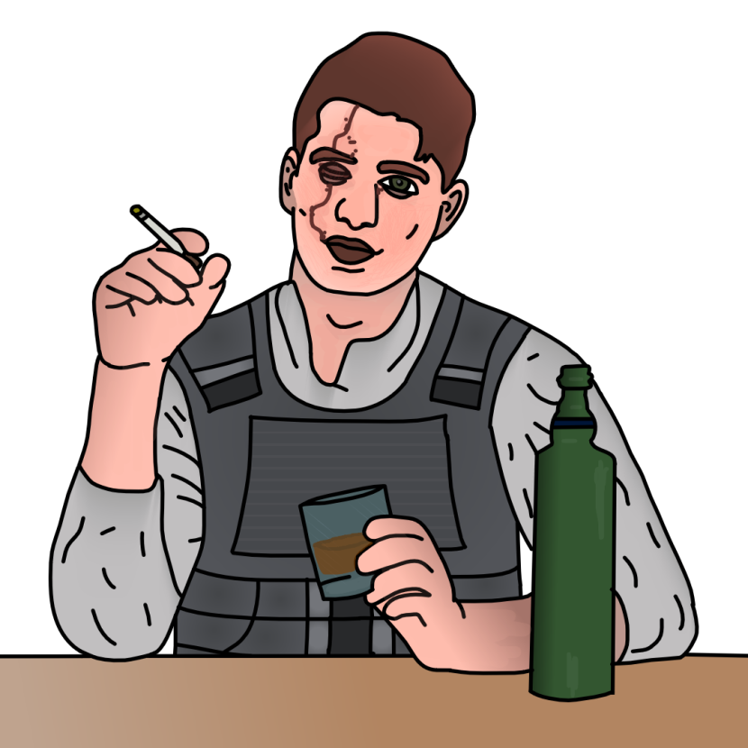

{ width="350" }

### **Neutral Field Operations**

“It’s time to make bank, Criminal Freelancer.”

Win Condition: Receive 5 payments.

### **Day:**

Unskilled Attack - Select a node, green or white. Leaves a log.

Overload Node (1 charge) - Select a white node. All connections and DDOS to this node will fail. If successful, gain 1 payment. Leaves a log.

Blackmail (3 charges) - Select a target operative. They cannot vote for two phases. If successful, gain 1 payment.

### **Night:**

Sell Illicit Arms (N1 -> N3 cooldown) - Select a target operative. If they do not have access to the skill Disorganized Murder, give them 1 charge of Disorganized Murder the following night. This charge of Disorganized Murder is removed if it is not used the night it is given. Gain 1 payment if successful, or if the target operative is Netsec, gain 2 payments and become “Criminal”. Visit them.

Getaway Driver (N1 -> N3 cooldown) - Escort a target operative, protecting the operative from arrests and murders. Both targets are immune to arrests and murders this round. Gain 1 payment, or if someone attempts to arrest the target operative, gain 2 payments and become “Criminal”. Visit and occupy them.

Wiretap (N1 -> N3 cooldown) - Select a target operative. Check the operative’s outgoing and ingoing communications to check the operative's vote power and whether they are force voted and to who. Gain 1 payment. Visit them.

Disorganized Murder - Select an operative and attempt to murder them. Visit the target. If you kill the target, gain 1 payment, or if the target operative is an agent, gain 2 payments and become “Criminal”.

### **Passives:**

No Dirt On Me - You are unarrestable unless framed. You do not know who attempted to arrest you. If you become “Criminal”, you will lose this passive.

Unknown Criminal - Become a “Criminal” upon doing certain actions, like selling arms to a Netsec operative, escorting someone who is targeted by an arrest, killing an agent, or blackmailing an agent.