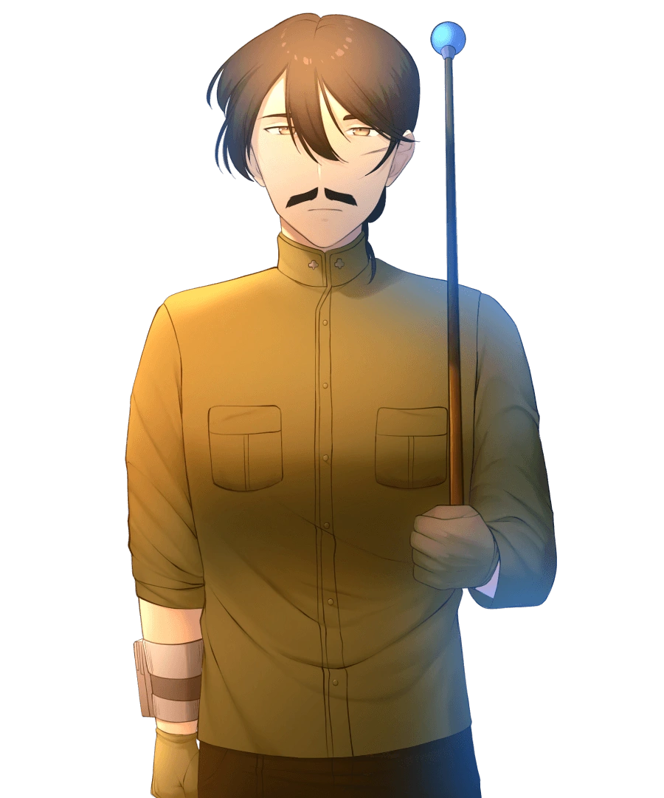

{ width="350" }

### **Neutral Field Operations**

This role is supposed to be unique, depending on the ruleset.

“You have to rejoin the force no matter what, Insane Officer.”

Win Condition: Become a mole for the agents, and win with agents. Opsec R is to kill the Core Agent and become the agent.

### **Day:**

Unskilled Attack - Select a node, green or white. Leaves a log.

Wireshark (D1 -> D4 cooldown) - Tells you the name of any operative that did a Denial of Service.

Steal Secured Channel Connection - Select a white node. If there is a dead mole, you can hack into ASC by trying to hack a node with a dead mole’s connection and become the mole. Leaves a log. Opsec R does the same if you hack an agent’s connection, becoming the Field Agent.

### **Night:**

Murder (1 charge) - Select an operative and murder them. Cannot be dodged in any way. Occupies and visits the target. If the target operative is a mole, kill them and become the mole. Opsec R allows you to become a Field Agent if you kill the core agent.

For the Cause (N1 -> N4 cooldown, 2 charges) - Find out if the target operative is a mole. Do not go through frames or cover. Visit them.

Doxx and Stalk (N1 -> N4 cooldown, 2 charges) - Select a target operative. Do not go through frames or cover. Learn this operative’s faction alignment and visit them.

### **Passives:**

Agent Scum - Any doxx attempts on you doxx you as Agent.