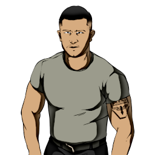

### **Neutral Field Operations**

“You’ve got an agenda to carry out, Loose Cannon.”

Win Condition: Win on the three of your objectives.

### **Day:**

Unskilled Attack - Select a node, green or white. Leaves a log.

### **Night:**

Fake Escort - Escort a target operative, but leave as soon as trouble comes, letting the original target die or get arrested. Visit and occupy them. Must select a different target the next night.

Follow (2 charges) - Select a target operative and follow them, visiting them and checking if they left their hideout and met anyone. If they were occupied, you’d only know that they could not leave their hideout.

Assault and Battery - Select an operative and attempt to murder them. Visit the target.

Citizen’s Arrest (N1 -> N3 cooldown, 3 charges) - Select a target operative and arrest them. Visit them.

### **Passives:**

Agent Scum - Any doxx attempts on you doxx you as Agent.

Loose Cannon - You gain 1 Netsec, 1 Neutral, and 1 against Netsec objectives, listed below.

Rent Free - Avoid the first arrest attempt and murder attempt on you.

 

Netsec Objectives

=======================================================================

Eliminate the Field Agent role.

Fake Escort 2 non-Netsec targets.

Kill a non-Netsec.

Eliminate a core agent role.

Eliminate the W3C Leader.

Follow a non-Netsec visiting another player.

Help Netsec vote out an agent.

Eliminate an agent mole.

Eliminate a W3C operative.

Eliminate a Neutral Killing role.

Make W3C lose.

Make agents lose.

Win with Netsec.

 

Neutral Objectives

=======================================================================

Eliminate a neutral operative.

Eliminate a Paragon operative.

Kill any operative.

Kill two operatives.

Eliminate the Operation Leader and the Field Agent role.

Fake Escort 2 players.

Arrest 1 operative with Citizen's Arrest.

Fake Escort someone who dies or gets arrested while you escort them.

Follow someone visiting another player.

Follow someone and find that the operative could not leave their hideout.

Follow someone and find that the operative did not leave their hideout.

Make Paragon lose.

Make a Neutral Killing role lose.

Win with Paragon.

 

Against Netsec Objectives

=======================================================================

Kill a Netsec.

Eliminate the Operation Leader.

Eliminate a Netsec field ops role.

Kill a Netsec hacking class.

Fake Escort a Netsec who was attempting to visit someone.

Arrest 1 Netsec operative with Citizen's Arrest.

Fake Escort an operative for 2 nights in a row. The chain is not broken if you are occupied.

Help the agents vote out a non-agent.

Help W3C vote out a non-W3C.

Help a Neutral Killing vote out someone else.

Make Netsec lose.

Win with agents.

Win with W3C.

Win with a Neutral Killing.