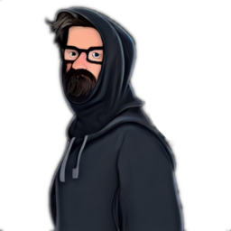

### **Neutral Investigative**

“You’ve worked with Netsec for a long time, but you question if the cause is worth it, maybe it is time to take the easy way out, Double Crosser.”

Win Condition: Guess a target operative’s role through Turn Yourself In and get both of you arrested.

### **Day:**

Hack Target (Very Low) - Select a white node and attempt to hack it. Leaves a log.

Download Intel - Select a green node and attempt to download from it. If there is intel, and you download and remove it first, you will get class intel, target node, or faction intel. Do not go through frames or cover. Leaves a log.

Review TCP Packets (N1 -> N4 cooldown, 2 charges) - Select a target operative and check if they used a hack today.

### **Night:**

Obtain Evidence (N1 -> N3 cooldown) - Select a target operative. Visit and occupy them, talking about the hack. Gain some intel, similar to Download Intel, getting class intel, target node, or faction intel. Do not go through frames or cover. Do not reveal yourself to them.

Wiretap (N1 -> N4 cooldown) - Select a target operative. Check the operative’s outgoing and ingoing communications to check the operative's vote power and whether they are force voted and to who. Visit them.

Review Specialization (N1 -> N4 cooldown, 2 charges) - Select a target operative. Learn their subclass, or framed or cover subclass. Do not go through frames or cover. Visit them.

Turn Yourself In - Select a target operative and guess their role. If you guess right, they get arrested no matter what, no matter the alignment. You are also arrested too. Removes all frames and covers.

### **Passives:**

One of Us - Any doxx attempts on you doxx you as Netsec.