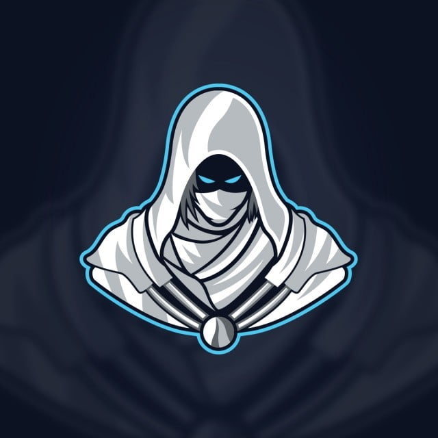

{ width="350" }

### **Neutral Investigative**

“You were a mainstay assassin until certain Netsec members betrayed you, so it’s time for some vengeance, Vengeful Assassin.”

Win Condition: You are given 2 target operatives. Guess, vote, or get the 2 target operatives killed or arrested. Can be any faction.

### **Day:**

Unskilled Attack - Select a node, green or white. Leaves a log.

Hack Target (Low) - Select a white node and attempt to hack it. Leaves a log.

Rerouted Denial of Service (2 charges) - Select a green or white node and block all connections to the node this day. Select a target operative to make this show up as the operative who used the denial of service with Wireshark. Do not leave a log.

Bait Law Enforcement - Select a target operative, inform agents that the target is one working for Netsec. Can be yourself. (Leaves the same message as Bounty Hunter’s Spill the Beans).

Vengeance (3 charges) - Select a target operative and guess their role. If you guess right, shoot the target operative tonight. Removes all frames and covers. You will know if you guessed right or wrong.

### **Night:**

Deductive Reasoning (N1 -> N3 cooldown) - Select a target operative. You will learn their faction, and their subclass. Do not go through frames or cover. Visit them.

Plant Agent Documentation (3 charges) - Select a target operative. If the operative is doxxed this round, they will be seen as an agent. If the operative is specialization reviewed, they will be seen as special. If the operative is asked the right question, they will be seen as unable to hack. If the operative is speech analyzed, they will be seen as unable to win with anyone. Visit them.

Misdirection (1 charge) - Occupy anyone that visits you directly, blocking any attempts to visit, occupy, and kill directly. Does not save you from Raids, Stings, and other indirect methods of killing this operative.

Vengeance (3 charges) - Select a target operatives and guess their role. If you guess right, shoot the target operative. Removes all frames and covers.

### **Passives:**

Hunter’s Mark - If you vote an operative that is your target, your vote counts as 2 votes.