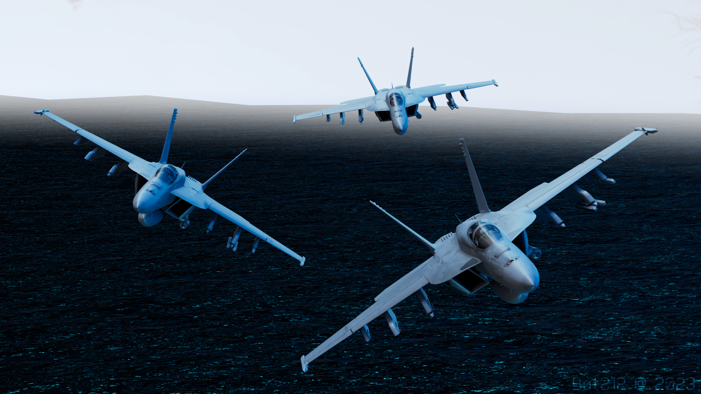

{ width="350" }

### **Neutral Killing**

This role is supposed to be unique, depending on the ruleset.

“Time to take the skies and light the fires, F/A-18 Super Hornet Pilot.”

Win Condition: Eliminate the majority of all hostile units (Netsec, Agents, and W3C).

### **Day:**

Unskilled Attack - Select a node, green or white. Leaves a log.

Rearm Missiles (2 charges) - Gain a charge of Double Strafe.

Electronic Countermeasures (2 charges) - Next phase will not announce any movement globally except that you have used Electronic Countermeasures.

### **Night:**

Strafe - Select a target operative and murder them and anyone who visits them. Visit them and go through all defensive abilities. It is globally announced that a Jet Fighter is seen going to the operative’s hideout.

Double Strafe (0 charges) - Select two target operatives and murder them and anyone who visits them. Visit them and go through all defensive abilities. It is globally announced that a Jet Fighter is seen going to one of the operatives’ hideouts.

Fake Flares (2 charges) - Select a target operative and shoot fake flares at them. It is globally announced that a Jet Fighter is seen going to the operative’s hideout.

Fly Over - Select a target operative and fly over them, visiting them and checking if they left their hideout and met anyone. If they were occupied, you’d only know that they could not leave their hideout. It is globally announced that a Jet Fighter is seen going to the operative’s hideout.

Misdirection (1 charge) - Occupy anyone that visits you directly, blocking any attempts to visit, occupy, and kill directly. Does not save you from Raids, Stings, and other indirect methods of killing this operative. (Will announce that the Jet Fighter is staying in his hideout).

### **Passives:**

To the Skies - You are immune to occupation at night.

Rare Sighting - Every night movement you make will be globally announced.

Raid Boss - Avoid the first two arrest or murder attempts on you.