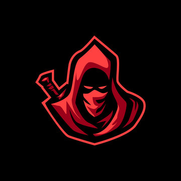

### **Neutral Killing**

This role is supposed to be unique, depending on the ruleset.

“You were hired to take care of the problems in this Opsec, but you don’t believe in the cause anymore, Rogue Assassin.”

Win Condition: Eliminate ALL hostile units (Netsec, Agents, and W3C). Opsec R requires you to kill all operatives once from the time you become the Neutral Killing role.

### **Day:**

Unskilled Attack - Select a node, green or white. Leaves a log.

Hack Target (Low) - Select a white node and attempt to hack it. Leaves a log.

Day Off (D1 -> D3 cooldown) - If you think that the operative getting voted is not someone that should die, don’t kill them. Unfortunately, you gotta get paid, so you have to kill once in a while. If The Assassin has been triggered, this ability is disabled.

Redirect Vote (2 charges) - If you would rather kill someone else, use a charge to kill that other operative instead of the operative getting voted. The other operative must have at least 1 vote.

My Aim is True - Select any number of target operatives and guess all their roles. If you guess right, attempt to shoot the target operative tonight. Removes all frames and covers. Cannot guess more than two of the same role in a single phase. If you fail, remove a charge of your defensive passive. You will know if you guessed right or wrong.

### **Night:**

Day Off (N1 -> N3 cooldown) - If you think that the operative getting voted is not someone that should die, don’t kill them. Unfortunately, you gotta get paid, so you have to kill once in a while. If The Assassin has been triggered, this ability is disabled.

Redirect Vote (2 charges) - If you would rather kill someone else, use a charge to kill that other operative instead of the operative getting voted. The other operative must have at least 1 vote.

My Aim is True - Select any number of target operatives and guess all their roles. If you guess right, attempt to shoot the target operative tonight. Removes all frames and covers. Cannot guess more than two of the same role in a single phase. If you fail, remove a charge of your defensive passive.

### **Passives:**

The Assassin - You were hired to be the one to remove threats that are voted out, but you won’t kill yourself. The Operation Leader will hire a new assassin to kill you the next time you are voted out though.

Raid Boss - Avoid the first two arrest or murder attempts on you.

Ground Operative - Specialization is always shown as field ops or social, you pick.