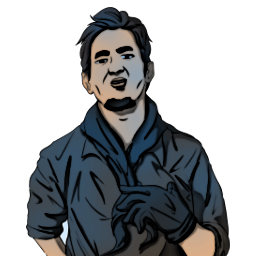

### **Neutral Killing**

This role is unique (one Operation Leader should spawn).

“It’s time to eliminate every last person involved in the Opsec, Sociopath Leader.”

Win Condition: Eliminate ALL hostile units (Netsec, Agents, and W3C). Opsec R requires you to kill all operatives once from the time you become the Neutral Killing role.

### **Day:**

Hack Target (High) - Select a white node and attempt to hack it. Leaves a log.

Give Root Access (1 charge) - Select an operative to give root to. They become any of Operation Leader, Blackmailed Leader, Sociopath Leader, W3C Operation Leader, Paragon Operation Leader, or are simply an agent, neutral, Paragon Leader, or W3C Leader with access to the special channel. A Neutral Leader can only spawn in.

### **Night:**

Murder with Goons - Select an operative and murder them. Cannot be dodged in any way, and cannot be occupied. Occupies the target.

Fake Emergency Extraction (N1 -> N3 cooldown, 3 charges) - Select an operative to fake escort, does not occupy them and doesn’t actually do anything except leaving escort feedback.

### **Passives:**

Authority - You have two votes.

Covert Broadcast - You should be given access to talk to all players in a specialized channel (global Opsec info).

Raid Boss - Avoid the first two arrest or murder attempts on you.

Operation Leader - You are one of the leading roles and should spawn every operation.