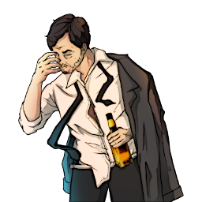

### **Neutral Social**

This role is supposed to be unique, depending on the ruleset.

“The Operation Leader wants you to solve this case, but he won’t know who is truly a traitor, Corrupt Detective.”

Win Condition: Frame two operatives that aren’t yours and get them both voted out. Opsec R requires you to frame and vote out another operative.

### **Day:**

Unskilled Attack - Select a node, green or white. Leaves a log.

Upload Fake Intel (1 charge) - Select a white or green node and upload intel that is downloadable by others. You can write what intel you want to leave. Leaves a log.

Jam Network (2 charges) - Select a target operative and disable all day actions related to the topology done by them.

Rerouted Denial of Service (2 charges) - Select a green or white node and block all connections to the node this day. Select a target operative to make this show up as the operative who used the denial of service with Wireshark. Do not leave a log.

### **Night:**

Paid Frame (N1 -> N3 cooldown) - Select a target operative. Change their role to be anything you want, which they will then have all intel abilities follow that frame. Removes No Dirt On Me and can be used on Agents, making them arrestable. Visit them.

Follow (2 charges) - Select a target operative and follow them, visiting them and checking if they left their hideout and met anyone. If they were occupied, you’d only know that they could not leave their hideout.

Throw Under the Bus (2 charges) - Select a target operative. All skills used on you will be used on the target operative.

### **Passives:**

Agent Scum - Any doxx attempts on you doxx you as Agent.