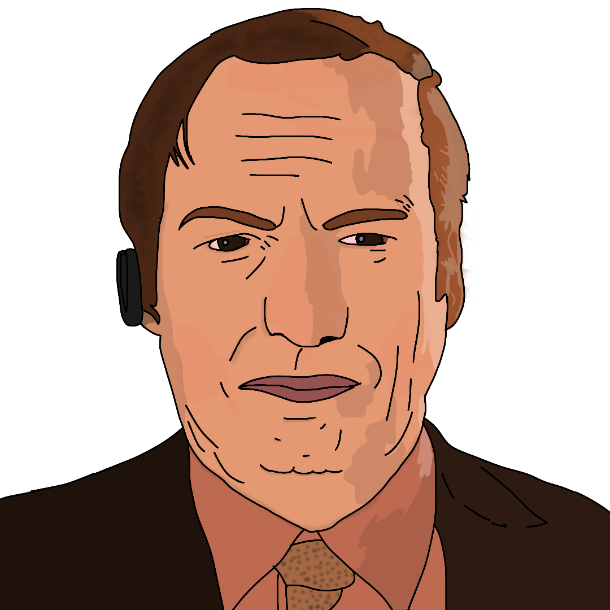

{ width="350" }

### **Neutral Social**

This role is supposed to be unique, depending on the ruleset.

“Cash in and protect the operative that hired you, Corrupt Lawyer.”

Win Condition: Make sure the target operative wins. (Random operative).

### **Day:**

Unskilled Attack - Select a node, green or white. Leaves a log.

Act as Prosecution - Select a target operative. The operative will have an extra vote (+1) against them in the next phase, not shown to the Opsec.

Act as Defense - Select a target operative. The operative will have an extra vote (-1) with them next phase, not shown to the Opsec.

Objection! - Force someone to vote for someone of your choice.

Cryptocurrency Trading - Trade currency for some intel. Instead of downloading, you can try to get intel through buying and selling crypto on the market. Do not go through frames or cover. Download Intel without leaving a connection log. Sometimes returns fake intel.

### **Night:**

Act as Prosecution - Select a target operative. The operative will have an extra vote (+1) against them in the next phase, not shown to the Opsec.

Act as Defense - Select a target operative. The operative will have an extra vote (-1) with them next phase, not shown to the Opsec.

Objection! - Force someone to vote for someone of your choice.

Paid Frame (N1 -> N3 cooldown) - Select a target operative. Change their role to be anything you want, which they will then have all intel abilities follow that frame. Removes No Dirt On Me and can be used on Agents, making them arrestable. Visit them.

### **Passives:**

Loyal to the End - If your target is voted out, die. If your target is murdered or arrested, you will randomly get another target that the owner of the first operative has to win with.

No Dirt On Me - You are unarrestable unless framed. You do not know who attempted to arrest you.