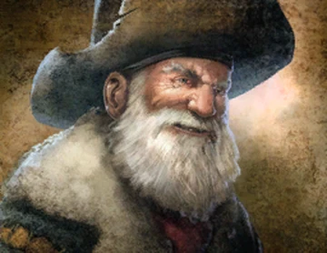

### **Neutral Social**

“Where’s your badge, maybe these people have it, Drunken Agent.”

Win Condition: Win 2 duels against anyone.

### **Day:**

Unskilled Attack - Select a node, green or white. Leaves a log.

Impersonate (1 charge) - Permanently rename your operative to whatever name you want. If you name it the same as another operative, targeting that operative will randomly target either operative of the same name.

Troll Operative (2 charges) - Permanently rename another operative to whatever name you want. If you name it the same as another operative, targeting that operative will randomly target either operative of the same name.

Blackmail (3 charges) - Select a target operative. They cannot vote for two phases.

### **Night:**

Snitch to Cops (N1 -> N4 cooldown) - Select a target operative. Attempt to arrest the operative with local cops. Do not visit them.

Duel - Select a target operative. The next day, you and your opponent choose between laptop, server, and PC. Laptop beats PC, PC beats server, and server beats laptop. If you win, the target is killed after the day ends. Cannot be dodged in any way. If you lose, the target operative gains 1 charge of Move Hideout. Visit them.

Paid Frame (N1 -> N3 cooldown) - Select a target operative. Change their role to be anything you want, which they will then have all intel abilities follow that frame. Removes No Dirt On Me and can be used on Agents, making them arrestable. Visit them.

### **Passives:**

Agent Scum - Any doxx attempts on you doxx you as Agent.

Unstable Mind - Whoever arrests you gets an extra STING charge. Doesn’t have to be an agent.

Rent Free - Avoid the first arrest attempt and murder attempt on you.