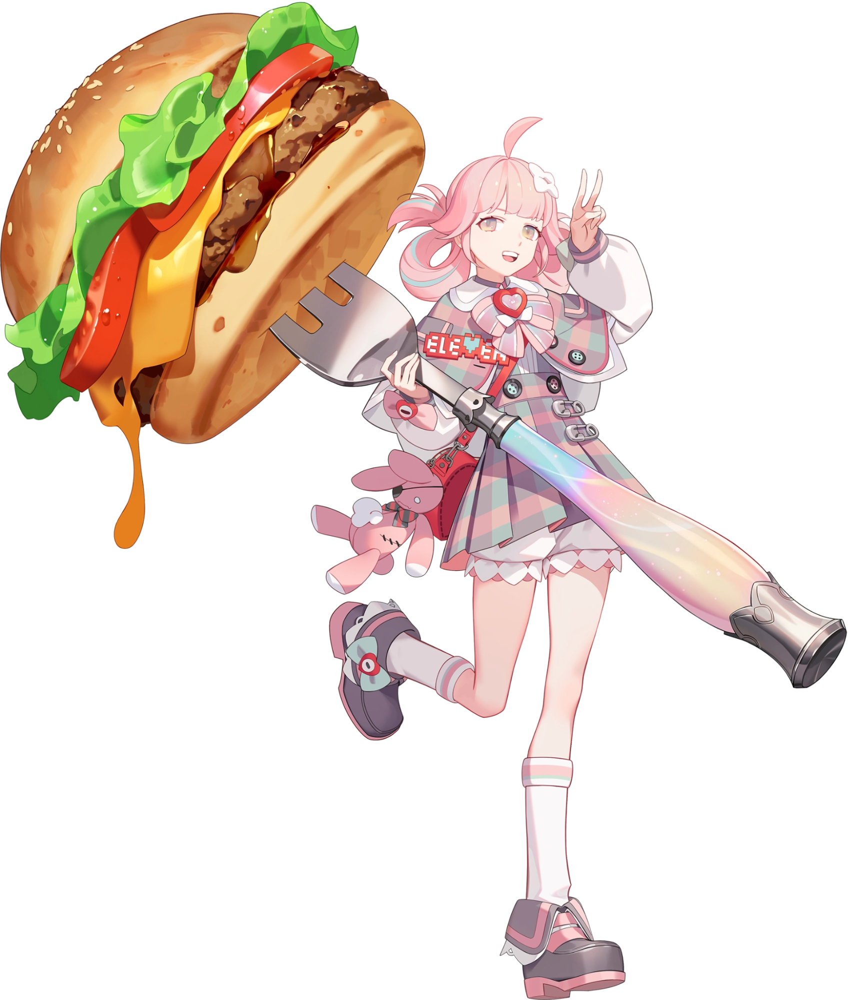

{ width="350" }

### **Neutral Special**

This role is unique (one Operation Leader should spawn).

“It’s time to go ham-burger, Cheeseburger Technician.”

Win Condition: Give 3 burgers to operatives of your choice.

### **Day:**

Unskilled Attack - Select a node, green or white. Leaves a log.

Smoke Break (1 charge) - Select four operatives. Make them all smoke with you, occupying them this day.

Prep Time - Choose two core ingredients between chicken, beef patty, steak, veggie patty, and pork chop. Grants 2 charges of Cook Burger.

Cook Burger (0 charges) - Cook a burger using a chosen ingredient that has been done in Prep Time. Gives a charge of Serve Burger.

Give Root Access (1 charge) - Select an operative to give root to. They become any of Operation Leader, Blackmailed Leader, Sociopath Leader, W3C Operation Leader, Paragon Operation Leader, or are simply an agent, neutral, Paragon Leader, or W3C Leader with access to the special channel. A Neutral Leader can only spawn in.

### **Night:**

Serve Burger (0 charges) - Select a target operative. Feed them a burger. Chicken Patty grants immunity to occupation this turn. Beef Patty occupies them. Steak gives them an extra action in the day. Veggie Patty gives them stomach issues, occupying them in the day. Pork Chop makes them dodge arrests or murder attempts for this turn (that are not guaranteed murders). Visit them.

Food Channel (1 charge) - Select four operatives. Make them all hungry, occupying them tonight.

### **Passives:**

Authority - You have two votes.

Covert Broadcast - You should be given access to talk to all players in a specialized channel (global Opsec info).

Operation Leader - You are one of the leading roles and should spawn every operation.

No Dirt On Me - You are unarrestable unless framed. You do not know who attempted to arrest you.