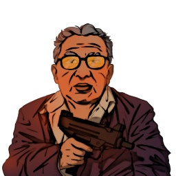

### **Neutral Special**

This role is supposed to be unique, depending on the ruleset.

“You remember their faces very well, or well enough, Resentful Criminal.”

Win Condition: Kill the original Operation Leader and a core agent, non mole role.

### **Day:**

Unskilled Attack - Select a node, green or white. Leaves a log.

Impersonate (1 charge) - Permanently rename your operative to whatever name you want. If you name it the same as another operative, targeting that operative will randomly target either operative of the same name.

Hack Private Channel (1 charge) - You can write one message to talk to all players in ASC or W3C channels, speaking directly to only Agent and/or W3C players, which appears next night.

### **Night:**

Looking for an Old Friend (N1 -> N3 cooldown) - Select a target operative, if they are a target, you will know. Goes through cover or frames. Visit them.

Interrogate (3 charges) - Select a target operative and occupy them. The host will ask them for their logs, giving you what they send.

Disorganized Murder - Select an operative and attempt to murder them. Visit the target.

Resentful Reunion (2 charges) - Select two operatives, if they are both a target of yours, kill them. If one is not your target, do nothing. Visit the first operative.

### **Passives:**

Paragon Spy - You have done business for Paragon in the past. If Paragon spawns in this Opsec, you will know about it.

W3C Scumbags - You're watching for those snakes at W3C. If W3C spawns in this Opsec, you will know about it.

Rent Free - Avoid the first arrest attempt and murder attempt on you.