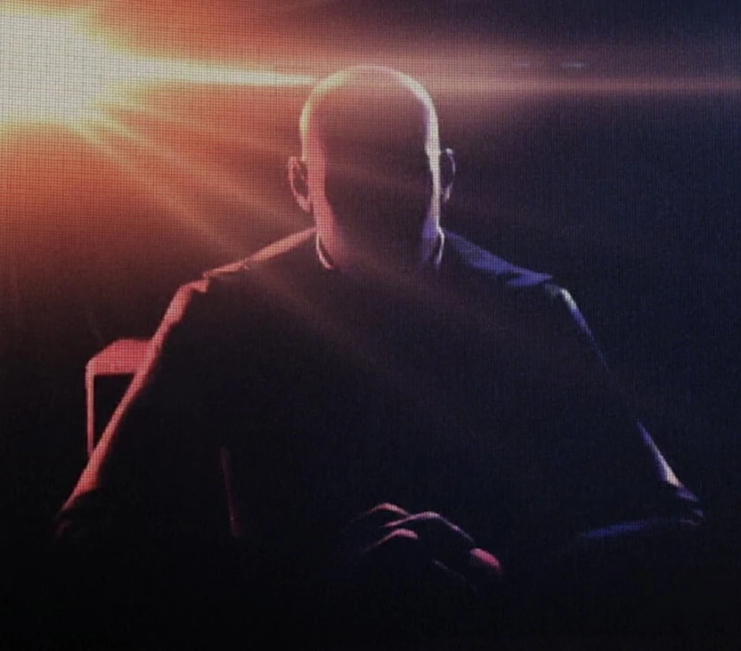

{ width="350" }

### **Neutral Special**

This role is supposed to be unique, depending on the ruleset.

“This Opsec is too important to be left in the hands of an incompetent leader, Employer.”

Win Condition: Hack the target node, or ransom the OL’s computer and give it to someone who isn't an agent.

### **Day:**

Hack Target (High) - Select a white node and attempt to hack it. Leaves a log.

Ransom Computer (3 charges) - Select a target operative. If the target operative has the ability to root, steal the ability to root, remove the current root, and grant 1 charge of Give Root Access.

Jam Network (2 charges) - Select a target operative and disable all day actions related to the topology done by them.

Broadcast Message (1 charge) - You can write one message to talk to all players in a specialized channel (global Opsec info). This message can appear when you want it tonight.

Give Root Access (0 charges) - Select an operative to give root to. Upon your death, they can choose to become an Operation Leader of their own faction or stay as their current role with broadcast.

### **Night:**

Midnight Meet (N1 -> N3 cooldown) - Select a target operative. Visit and occupy them, talking about the hack. 

Emergency Extraction (N1 -> N3 cooldown, 3 charges) - Select an operative to escort, does not occupy them and makes them immune to everything unless otherwise stated. Do not visit them.

Special Orders (1 charge) - Select an operative and murder them. Occupies but does NOT visit the target.

### **Passives:**

Authority - You have two votes.

Lack of Leadership - If you are rooted, the original Operation Leader dies, and you choose not to become the Operation Leader, you gain a charge of Give Root Access.

No Dirt On Me - You are unarrestable unless framed. You do not know who attempted to arrest you.

The Big Fish - Whoever arrests you gets two STING charges. Doesn’t have to be an agent.

Employer’s Camouflage - Pick your class that you are entirely framed as, which you will then have all intel abilities follow that frame. This does not remove No Dirt On Me.