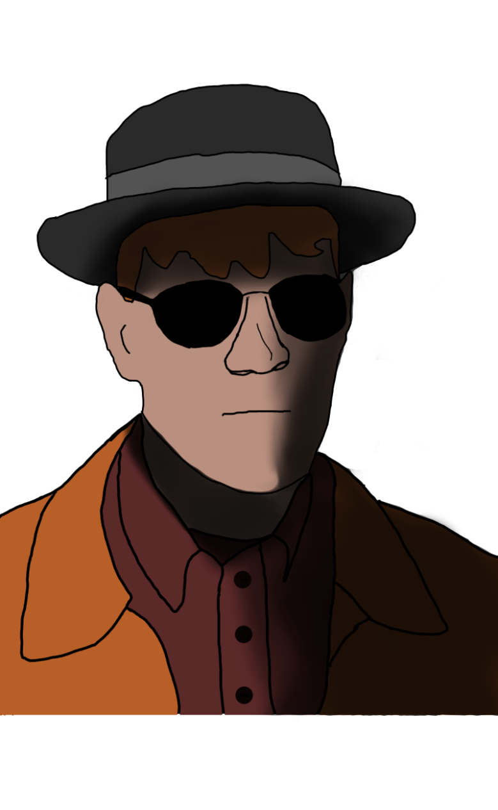

{ width="200" }

### **Neutral Utility**

This role is supposed to be unique, depending on the ruleset.

“Chemistry teacher by day, ruthless kingpin by night, this Opsec is the perfect chance for a huge score, Insane Drug Dealer.”

Win Condition: End the game with 2 shipments and overdose 2 operatives of your choice.

### **Day:**

Unskilled Attack - Select a node, green or white. Leaves a log.

Prepare Drugs - Gives two charges of drugs of choice to use at night, including Shipments.

Enforce Alibi - Act like a chemistry teacher tonight, pretending to have done nothing to action checking investigative abilities.

### **Night:**

Sell Meth (1 charge) - Select a target operative. Sell them Methamphetamine and make them immune to occupation for this turn. Visit them.

Sell Adderall (1 charge) - Select a target operative. Sell them Adderall, and give them one extra action in the day. Visit them.

Sell Cocaine (1 charge) - Select a target operative. Sell them Cocaine, and make them dodge arrests or murder attempts for this turn (that are not guaranteed murders). Visit them.

Sell Shipment (0 charges) - Sell a shipment.

Plant Drug (2 charges) - Select a target operative. Plant a drug on the operative and remove No Dirt on Me. Visit them.

### **Passives:**

Overdose - If you give someone drugs three times in a row, they overdose and immediately die.

Bulk Selling - Do two actions per night.

Rent Free - Avoid the first arrest attempt and murder attempt on you.