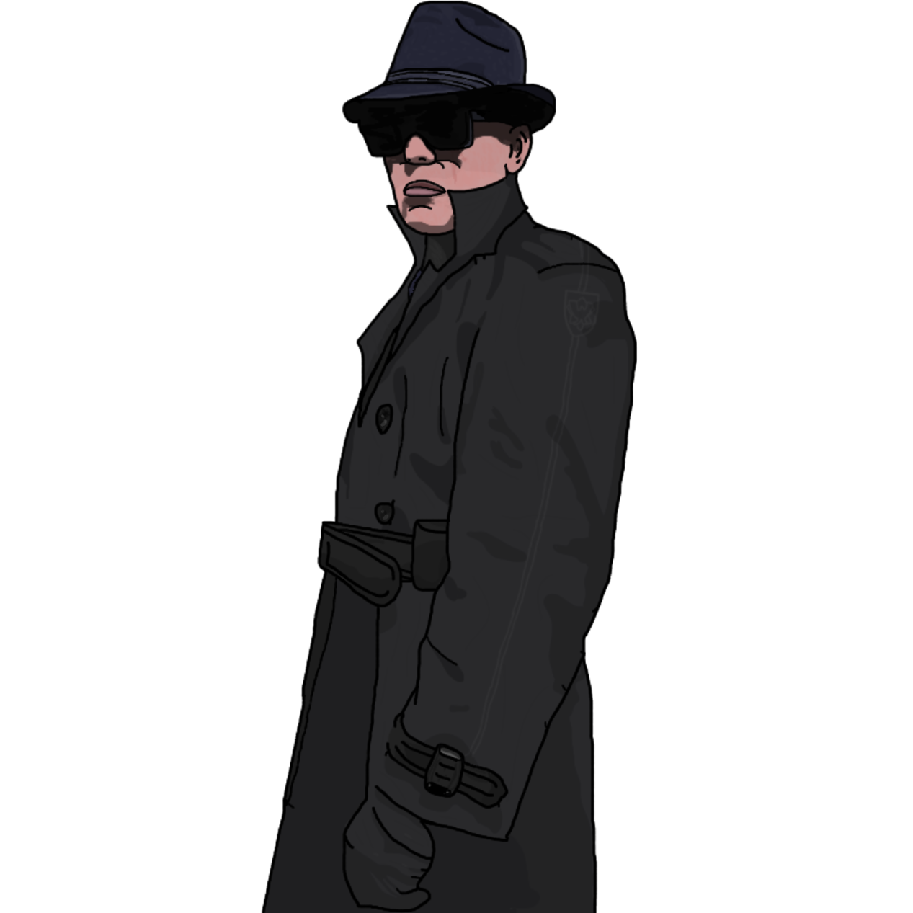

{ width="350" }

### **Neutral Utility**

“Plenty of people want you out of the picture, W.P.P. Member.”

Win Condition: Survive and don’t get arrested, or win with the chosen faction.

### **Day:**

Hack Target (Low) - Select a white node and attempt to hack it. Leaves a log.

Denial of Service (2 charges) - Select a green or white node and block all connections to the node this day. Do not leave a log.

Hack Private Channel (1 charge) - You can write one message to talk to all players in ASC or W3C channels, speaking directly to only Agent and/or W3C players, which appears next night.

Desperate Measures (1 charge) - Turn into a Prodigy.

### **Night:**

Contact Law Enforcement (N1 -> N3 cooldown, 3 charges) - Select a target operative. If they are an agent, learn their role, they will learn yours. Goes through cover or frames. Visit them.

Contact W.P.P. (N1 -> N4 cooldown, 2 charges) - If any operative visits you tonight, they will be arrested. Dodge any attempts to arrest you.

Old Friends (3 charges) - Select a target operative. If they are a Netsec member, you and agents will learn their role. Goes through cover or frames. Visit them.

Runaway Operative (1 charge) - Turn into an Agent Whitehat.

### **Passives:**

On the Run - If you are murdered (not by vote), the Operation Leader will learn the identity of two Netsec members. Goes through cover or frames.