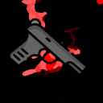

The Really Bad Guys

“I’m here to kill everyone, you all wronged me and I will get my revenge.”

Win condition: Eliminate ALL hostile units (Netsec, Agents, and W3C). Opsec R requires you to kill all operatives once from the time you become the Neutral Killing role.

These roles have significant power, given that they are basically entirely alone. They are singly stronger than most roles in the game. These roles have a special subclass unless otherwise stated. All these roles are designed to be unique, depending on the ruleset.