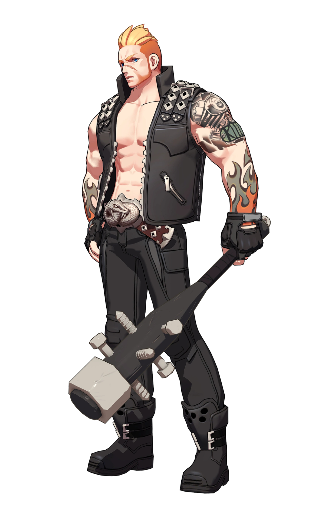

{ width="250" }

### **Paragon Field Operations**

“You’ve given up the mercenary life to help Paragon, Paragon Ex-mercenary.”

Win Condition: Make all factions have only 50% of their operatives, including Netsec, W3C, and agents. Opsec R requires the current W3C and agent operative to die once.

### **Day:**

Unskilled Attack - Select a node, green or white. Leaves a log.

Hack Target (Very Low) - Select a white node and attempt to hack it. Leaves a log.

Jam Network (2 charges) - Select a target operative and disable all day actions related to the topology done by them.

### **Night:**

Sell Illicit Arms (N1 -> N3 cooldown) - Select a target operative. If they do not have access to the skill Disorganized Murder, give them 1 charge of Disorganized Murder the following night. This charge of Disorganized Murder is removed if it is not used the night it is given. Visit them.

Disorganized Murder - Select an operative and attempt to murder them. Visit the target.

### **Passives:**

None.